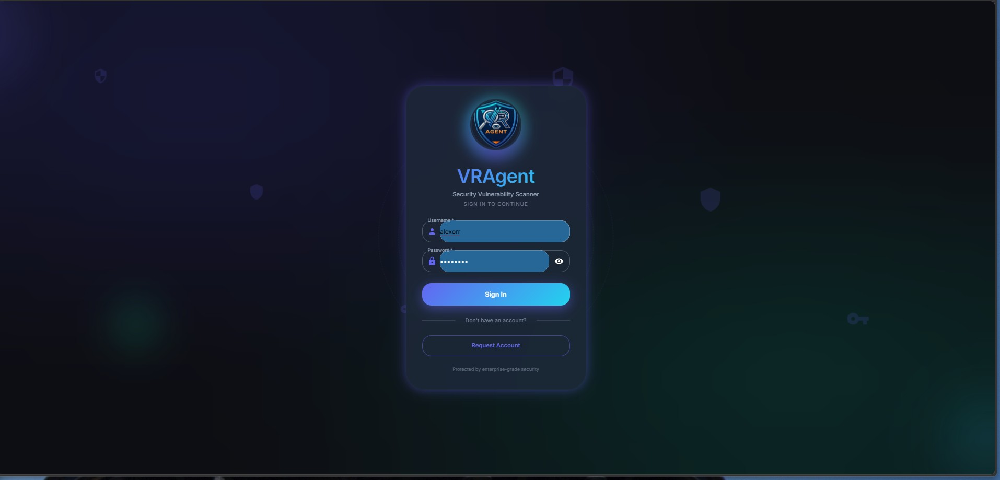
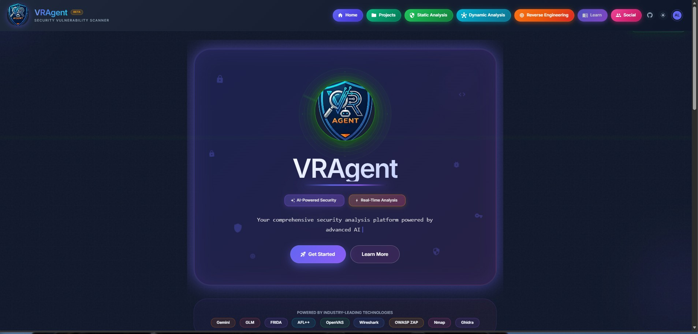
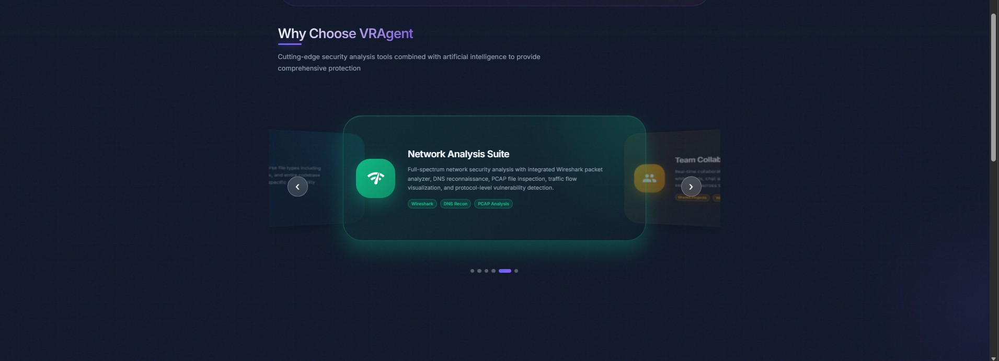
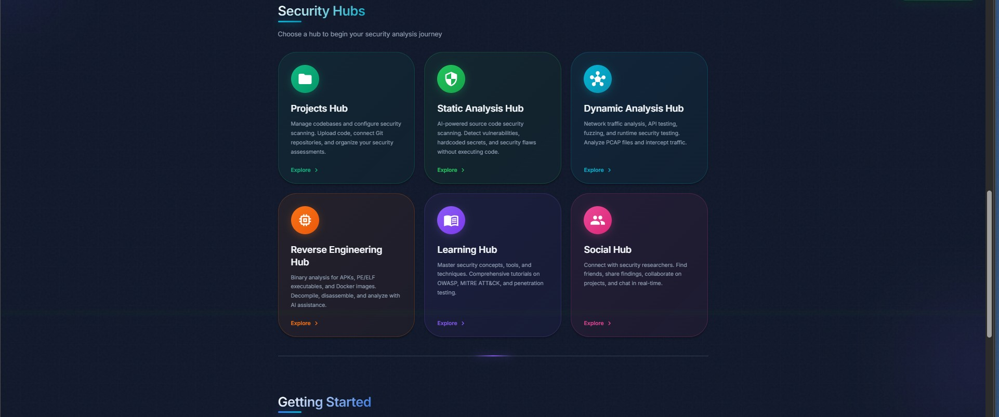
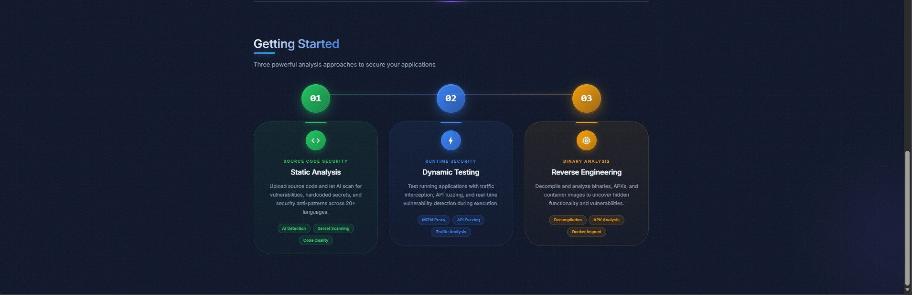

# VRAgent - AI-Powered Security Vulnerability Research Platform

VRAgent is a comprehensive, end-to-end platform for automated security vulnerability scanning, analysis, and education. Built for security professionals, penetration testers, and developers who want to identify and understand security vulnerabilities in their code, networks, and applications.

## What is VRAgent?

VRAgent combines **14+ static analysis scanners**, **AI-orchestrated dynamic testing**, **reverse engineering tools**, and an **interactive learning hub** into a single unified platform. It uses Google Gemini AI to provide intelligent analysis, exploit narratives, and remediation guidance.

**Key Capabilities:**
- Scan source code for vulnerabilities across 30+ programming languages
- Perform AI-orchestrated dynamic security testing with 8+ integrated tools
- Analyze binaries (PE/ELF), Android APKs, and Docker images
- Generate detailed security reports with AI-powered exploit scenarios
- Learn security concepts through 105+ interactive educational topics

## Screenshots

### Login



### Home Page

| | |
|:---:|:---:|
|  |  |
|  |  |

> **More Screenshots:** See individual documentation pages for feature-specific screenshots.

## Feature Summary

| Hub | Description | Key Features |
|-----|-------------|--------------|
| **[Projects](docs/PROJECT_README.md)** | Project management and collaboration | Kanban boards, whiteboards, team chat, combined analysis reports |
| **[Static Analysis](docs/STATIC_ANALYSIS_README.md)** | Source code security scanning | 14 SAST scanners, dependency analysis, secret detection, AI vulnerability hunting |
| **[Dynamic Analysis](docs/DYNAMIC_ANALYSIS_README.md)** | Runtime and network security testing | ZAP, Nuclei, Nmap, MITM proxy, API testing, fuzzing tools |
| **[Reverse Engineering](docs/REVERSE_ENGINEERING_README.md)** | Binary and application analysis | PE/ELF analysis, APK decompilation, Docker inspection, AI-powered analysis |
| **[Learning Hub](docs/LEARNING_HUB_README.md)** | Security education and training | 105 topics, AI chat assistant, interactive guides |
| **[Social Hub](docs/SOCIAL_HUB_README.md)** | Collaboration and community | Friends, messaging, groups, real-time presence |

## Architecture

VRAgent is built as a modern, containerized application using Docker. The architecture consists of multiple specialized services working together:

```
                                    ┌─────────────────────────────────────────────────────────────────┐
                                    │                         VRAgent Platform                         │
                                    └─────────────────────────────────────────────────────────────────┘
                                                                   │
                    ┌──────────────────────────────────────────────┼──────────────────────────────────────────────┐
                    │                                              │                                              │
                    ▼                                              ▼                                              ▼
        ┌───────────────────┐                          ┌───────────────────┐                          ┌───────────────────┐
        │   Frontend (UI)   │                          │   Backend (API)   │                          │   Worker (Jobs)   │
        │   React + Vite    │◀────────────────────────▶│     FastAPI       │◀────────────────────────▶│   Background      │
        │   Material UI     │                          │   REST + WebSocket │                          │   Processing      │
        │   Port: 3000      │                          │   Port: 8000      │                          │                   │
        └───────────────────┘                          └─────────┬─────────┘                          └───────────────────┘
                                                                 │
                    ┌────────────────────────────────────────────┼────────────────────────────────────────────┐
                    │                                            │                                            │
                    ▼                                            ▼                                            ▼
        ┌───────────────────┐                          ┌───────────────────┐                          ┌───────────────────┐
        │    PostgreSQL     │                          │       Redis       │                          │    External AI    │
        │    + pgvector     │                          │   Cache + Queue   │                          │   Google Gemini   │
        │    Port: 5432     │                          │   Port: 6379      │                          │                   │
        └───────────────────┘                          └───────────────────┘                          └───────────────────┘

                    ┌────────────────────────────────────────────────────────────────────────────────────────────┐
                    │                                    Security Scanners                                        │
                    └────────────────────────────────────────────────────────────────────────────────────────────┘
                                                                 │
        ┌──────────────┬──────────────┬──────────────┬──────────┴───────────┬──────────────┬──────────────┐
        │              │              │              │                      │              │              │
        ▼              ▼              ▼              ▼                      ▼              ▼              ▼
    ┌────────┐    ┌────────┐    ┌────────┐    ┌──────────┐           ┌──────────┐    ┌────────┐    ┌────────┐
    │  ZAP   │    │Scanner │    │OpenVAS │    │Prometheus│           │ Grafana  │    │ Juice  │    │  More  │
    │ DAST   │    │ Nmap   │    │  GVM   │    │ Metrics  │           │Dashboard │    │  Shop  │    │  ...   │
    │  8090  │    │ Nuclei │    │  9392  │    │   9090   │           │   3001   │    │  3003  │    │        │
    └────────┘    │  9999  │    └────────┘    └──────────┘           └──────────┘    └────────┘    └────────┘
                  └────────┘
```

### Technology Stack

| Component | Technology | Purpose |
|-----------|------------|---------|
| **Frontend** | React 18, Vite, Material UI, TypeScript | Modern SPA with real-time updates |
| **Backend** | FastAPI, Python 3.11+, SQLAlchemy | REST API with async support |
| **Database** | PostgreSQL 16 + pgvector | Data storage with vector embeddings |
| **Cache/Queue** | Redis 7 | Job queuing, caching, WebSocket pub/sub |
| **AI** | Google Gemini | Code analysis, exploit narratives, orchestration |
| **Containers** | Docker, Docker Compose | Deployment and orchestration |

### Docker Services (11 Containers)

| Service | Container Name | Port | Description |
|---------|---------------|------|-------------|
| **Frontend** | vragent-frontend | 3000 | React web application (nginx) |
| **Backend** | vragent-backend | 8000 | FastAPI REST API server |
| **Worker** | vragent-worker | - | Background job processor |
| **Database** | vragent-db | 5432 | PostgreSQL with pgvector |
| **Redis** | vragent-redis | 6379 | Caching and job queue |
| **ZAP** | vragent-zap | 8090 | OWASP ZAP dynamic scanner |
| **Scanner** | vragent-scanner | 9999 | Nmap + Nuclei scanner sidecar |
| **OpenVAS** | vragent-openvas | 9392 | Greenbone vulnerability scanner |
| **Prometheus** | vragent-prometheus | 9090 | Metrics collection |
| **Grafana** | vragent-grafana | 3001 | Monitoring dashboards |
| **Juice Shop** | vragent-juiceshop | 3003 | Practice vulnerable application |

### System Requirements

| Environment | RAM | CPU | Disk | Notes |
|-------------|-----|-----|------|-------|
| **Minimum** | 8 GB | 4 cores | 20 GB | OpenVAS may be slow |
| **Recommended** | 16 GB | 8 cores | 50 GB | Full functionality |
| **Production (20+ users)** | 32+ GB | 16 cores | 100 GB | Multiple workers |

---

## Installation

### Prerequisites

- **Docker Desktop** (Windows/macOS) or **Docker Engine** (Linux)
- **Git** for cloning the repository
- **8GB+ RAM** available for Docker
- **(Optional)** Google Gemini API key for AI features

---

## Linux Installation (Ubuntu/Debian)

### Step 1: Update System

```bash
sudo apt update && sudo apt upgrade -y
```

### Step 2: Install Docker

```bash
# Install prerequisites
sudo apt install -y ca-certificates curl gnupg

# Add Docker GPG key
sudo install -m 0755 -d /etc/apt/keyrings
curl -fsSL https://download.docker.com/linux/ubuntu/gpg | sudo gpg --dearmor -o /etc/apt/keyrings/docker.gpg
sudo chmod a+r /etc/apt/keyrings/docker.gpg

# Add Docker repository (Ubuntu)
echo "deb [arch=$(dpkg --print-architecture) signed-by=/etc/apt/keyrings/docker.gpg] https://download.docker.com/linux/ubuntu $(. /etc/os-release && echo "$VERSION_CODENAME") stable" | sudo tee /etc/apt/sources.list.d/docker.list > /dev/null

# Install Docker
sudo apt update
sudo apt install -y docker-ce docker-ce-cli containerd.io docker-buildx-plugin docker-compose-plugin

# Add user to docker group
sudo usermod -aG docker $USER
newgrp docker

# Verify installation
docker run hello-world
```

> **For Debian:** Replace `ubuntu` with `debian` in the repository URL.

### Step 3: Install Git

```bash
sudo apt install -y git
git --version
```

### Step 4: Clone VRAgent

```bash
cd ~
git clone https://github.com/ShabalalaWATP/VRAgent.git
cd VRAgent
```

### Step 5: Configure Environment

```bash
# Copy environment template
cp .env.example .env

# (Optional) Edit to add your Gemini API key
nano .env
```

**Environment Variables:**

| Variable | Required | Description |
|----------|----------|-------------|
| `POSTGRES_PASSWORD` | Yes | Database password (default provided) |
| `SECRET_KEY` | Yes | JWT signing key (change in production!) |
| `GEMINI_API_KEY` | No | Google Gemini API key for AI features |
| `NVD_API_KEY` | No | NIST NVD API key for CVE enrichment |

Get a free Gemini API key at: https://aistudio.google.com/app/apikey

### Step 6: Start VRAgent

```bash
# Start all services (first run downloads images - 10-15 minutes)
docker compose up -d

# Wait for services to be healthy (2-3 minutes)
docker compose ps

# Run database migrations
docker compose exec backend alembic upgrade head
```

### Step 7: Access VRAgent

Open your browser and navigate to:

| Service | URL | Description |
|---------|-----|-------------|
| **VRAgent App** | http://localhost:3000 | Main application |
| **API Docs** | http://localhost:8000/docs | Interactive API documentation |
| **Grafana** | http://localhost:3001 | Monitoring dashboards |

**Default Admin:** `admin` / `admin` (change immediately!)

---

## Windows Installation

### Step 1: Install Docker Desktop

1. Download from https://www.docker.com/products/docker-desktop/
2. Run the installer
3. **Enable "Use WSL 2 instead of Hyper-V"**
4. Restart your computer
5. Wait for Docker Desktop to show "Running" in system tray

> **WSL 2 Required:** If prompted, install the WSL 2 Linux kernel update from the link provided.

### Step 2: Install Git

1. Download from https://git-scm.com/download/win
2. Run installer with default settings
3. Verify in PowerShell: `git --version`

### Step 3: Clone VRAgent

Open PowerShell and run:

```powershell
cd $HOME\Documents
git clone https://github.com/ShabalalaWATP/VRAgent.git
cd VRAgent
```

### Step 4: Configure Environment

```powershell
# Copy environment template
Copy-Item .env.example .env

# (Optional) Edit to add your Gemini API key
notepad .env
```

### Step 5: Start VRAgent

```powershell
# Start all services
docker-compose up -d

# Wait for services (check status)
docker-compose ps

# Run database migrations
docker-compose exec backend alembic upgrade head
```

### Step 6: Access VRAgent

Open your browser to http://localhost:3000

**Default Admin:** `admin` / `admin` (change immediately!)

---

## User Management

VRAgent supports multi-user authentication with role-based access control.

### Default Admin Account

On first startup, VRAgent creates a default admin account:
- **Username:** `admin`
- **Password:** `admin`

> **Security Warning:** Change this immediately in production! Create your own admin account, then delete the default one.

### User Roles

| Role | Permissions |
|------|-------------|
| **Admin** | Full access, user management, system settings |
| **User** | Create projects, run scans, view reports |

### Authentication Flow

1. **Login:** Users authenticate at `/login` with username and password
2. **Account Requests:** New users request accounts at `/register` (requires admin approval)
3. **Token Refresh:** Access tokens auto-refresh seamlessly in the background

### Admin Panel (`/admin`)

Administrators can manage users through the Admin Panel:

- Approve or reject account requests
- Create new users directly
- Suspend or reactivate accounts
- Change user roles (user/admin)
- Reset user passwords

### Token Configuration

Configure token expiry in your `.env` file:

```env
SECRET_KEY=your-secure-random-key-change-in-production
ACCESS_TOKEN_EXPIRE_MINUTES=240    # Default: 4 hours
REFRESH_TOKEN_EXPIRE_DAYS=7        # Default: 7 days
```

> **Important:** Always use a strong, random `SECRET_KEY` in production (32+ characters).

---

## Quick Reference Commands

### Start/Stop

```bash
# Start all services
docker compose up -d

# Stop all services
docker compose down

# View logs
docker compose logs -f

# View specific service logs
docker compose logs backend worker
```

### Maintenance

```bash
# Check service health
docker compose ps

# Restart services
docker compose restart

# Update to latest version
git pull
docker compose down
docker compose up -d --build
docker compose exec backend alembic upgrade head
```

### Reset

```bash
# Complete reset (deletes all data!)
docker compose down -v
docker compose up -d
docker compose exec backend alembic upgrade head
```

---

## Troubleshooting

### Common Issues

| Problem | Solution |
|---------|----------|
| **"Docker daemon not running"** | Start Docker Desktop and wait for the whale icon to stop animating |
| **"Port 3000 already in use"** | Another app is using port 3000. Close it or change the port in `docker-compose.yml` |
| **"Cannot connect to database"** | Wait 30 seconds after `docker compose up`, then retry the migration |
| **Containers keep restarting** | Check logs: `docker compose logs backend worker` |
| **Scans stuck at 0%** | Check worker logs: `docker compose logs worker` |
| **"Failed to fetch" in browser** | Backend not ready. Wait 30 seconds and refresh |
| **WebSocket not connecting** | Check Redis health: `docker compose ps` |
| **OpenVAS stuck on "starting"** | Normal on first run - downloads 50GB+ of feeds. Wait 10-15 minutes |
| **Out of memory errors** | Increase Docker memory limit to at least 8GB in Docker Desktop settings |
| **"Login failed"** | Verify credentials. Default is `admin`/`admin` |
| **AI features not working** | Check `GEMINI_API_KEY` is set in `.env` file |

### Checking Service Health

```bash
# View all container statuses
docker compose ps

# Check specific service logs
docker compose logs backend
docker compose logs worker
docker compose logs zap

# Follow logs in real-time
docker compose logs -f
```

### Resetting the Application

```bash
# Restart all services (keeps data)
docker compose restart

# Full reset (WARNING: deletes all data!)
docker compose down -v
docker compose up -d
docker compose exec backend alembic upgrade head
```

For more detailed troubleshooting, see [docs/TROUBLESHOOTING.md](docs/TROUBLESHOOTING.md).

---

## Documentation

Detailed documentation for each component:

- **[Projects](docs/PROJECT_README.md)** - Project management, kanban boards, whiteboards, team collaboration
- **[Static Analysis](docs/STATIC_ANALYSIS_README.md)** - Code scanning, SAST tools, dependency analysis
- **[Dynamic Analysis](docs/DYNAMIC_ANALYSIS_README.md)** - Network scanning, MITM, API testing, fuzzing
- **[Reverse Engineering](docs/REVERSE_ENGINEERING_README.md)** - Binary analysis, APK decompilation, Docker inspection
- **[Learning Hub](docs/LEARNING_HUB_README.md)** - Educational content, AI chat assistant
- **[Social Hub](docs/SOCIAL_HUB_README.md)** - Friends, messaging, group collaboration
- **[Architecture](docs/ARCHITECTURE.md)** - Detailed system architecture
- **[Troubleshooting](docs/TROUBLESHOOTING.md)** - Common issues and solutions

---

## Contributing

Contributions are welcome! Please feel free to submit a Pull Request.

## License

This project is licensed under the MIT License.

## Support

- **Issues:** https://github.com/ShabalalaWATP/VRAgent/issues
- **Discussions:** https://github.com/ShabalalaWATP/VRAgent/discussions
