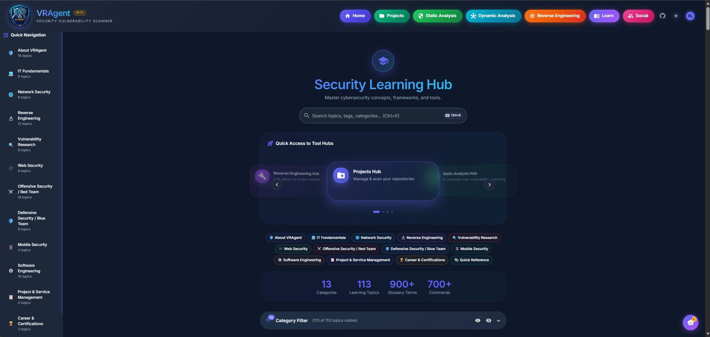
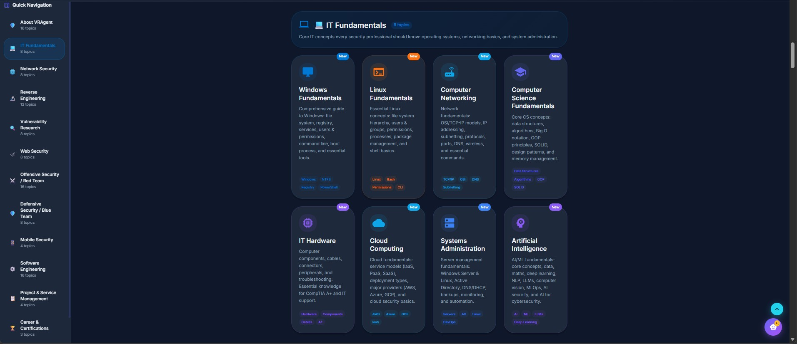

# Learning Hub

## Overview

The Learning Hub is VRAgent's comprehensive security education platform featuring **113+ interactive topics** across **13 categories**. Each learning page includes an AI-powered chat assistant that understands the current topic context, enabling interactive Q&A learning.

## Accessing the Learning Hub

- **URL:** `/learn`
- **Navigation:** Click "Learn" button in the top navigation bar
- **Authentication:** Required (login to access)
- **Keyboard Shortcut:** `Ctrl+K` opens global search from any page

---

## Screenshots

| | |
|:---:|:---:|
|  |  |

---

## Navigation Features

### Global Search (Ctrl+K)

| Feature | Description |
|---------|-------------|
| **Fuzzy Search** | Find topics even with typos or partial matches |
| **Instant Results** | Real-time filtering as you type |
| **Keyboard Navigation** | Arrow keys to navigate, Enter to select |
| **Category Display** | Shows which category each result belongs to |

### Quick Jump Sidebar

| Feature | Description |
|---------|-------------|
| **Collapsible Categories** | Expand/collapse each category section |
| **Topic Count Badges** | Shows number of topics per category |
| **Current Page Highlight** | Highlights your current location |
| **Persistent State** | Remembers expanded/collapsed state |

### Category Chips

| Feature | Description |
|---------|-------------|
| **Horizontal Scroll** | Swipe through categories on mobile |
| **Quick Filter** | Click to jump to category section |
| **Color Coded** | Each category has distinct color |
| **Topic Count** | Shows number of topics |

### Back to Top

- Floating button appears after scrolling down
- Smooth scroll animation
- Available on all learning pages

---

## AI Chat Assistant

Every learning page includes an AI-powered chat assistant for interactive learning.

### Features

| Feature | Description |
|---------|-------------|
| **Context Awareness** | AI understands the current page topic |
| **Conversation History** | Maintains context across multiple questions |
| **Markdown Responses** | Formatted text, code blocks, tables, lists |
| **Code Highlighting** | Syntax highlighting for code examples |
| **Copy to Clipboard** | One-click copy for any response |
| **Minimize/Maximize** | Resize chat window as needed |
| **Clear Chat** | Start fresh conversation |

### How to Use

1. Click the **AI Assistant** button (bottom right corner)
2. Type your question about the current topic
3. Press Enter or click Send
4. AI responds with context-aware answer
5. Ask follow-up questions for deeper understanding

### Example Questions

| Topic | Example Question |
|-------|------------------|
| **Buffer Overflow** | "How does stack canary protection work?" |
| **SQL Injection** | "Show me a UNION-based injection example" |
| **Nmap** | "What's the difference between -sS and -sT scans?" |
| **MITRE ATT&CK** | "What techniques are used for credential access?" |
| **Python** | "How do I read a file line by line?" |

### Suggested Questions

Each page provides topic-specific suggested questions to help guide your learning:
- Click any suggestion to instantly ask that question
- Suggestions are tailored to the current topic
- Great for discovering what to learn next

---

## Learning Categories

### 1. About VRAgent (16 topics)

Complete guides to VRAgent's tools and features.

| Topic | Description | Tags |
|-------|-------------|------|
| **Static Analysis Scanner** | 10-phase scanning pipeline, 11 SAST scanners, AI analysis | SAST, Gemini AI, Agentic |
| **VRAgent Architecture** | Docker services, backend architecture, data models | Docker, FastAPI, PostgreSQL |
| **Dynamic Analysis Hub Guide** | 10 tools: Scanner, Nmap, PCAP, SSL, DNS, Fuzzing, MITM | Dynamic Scanner, Nmap, PCAP |
| **PCAP Analyzer Guide** | Packet capture analysis, filters, protocol dissection | Filters, BPF, Packets |
| **Dynamic Scanner Guide** | AI-orchestrated pentesting with ZAP, Nuclei, OpenVAS | AI-Powered, Pentesting |
| **SSL/TLS Scanner Guide** | 12 CVE checks, certificate validation, cipher analysis | Certificates, Vulnerabilities |
| **DNS Analyzer Guide** | Enumeration, subdomain discovery, zone transfers | DNS, Subdomains, Email Security |
| **Nmap & Traceroute Analyzer** | 4-in-1 network analysis, 14 scan types, command builder | Nmap, Traceroute, NSE Scripts |
| **API Endpoint Tester Guide** | CIDR scanning, JWT/WebSocket testing, batch operations | CIDR Scanning, JWT, WebSocket |
| **Fuzzing Tools Guide** | Security Fuzzer, Agentic Fuzzer, Binary Fuzzer | Security Fuzzer, Agentic, Binary |
| **MITM Workbench Guide** | Traffic interception, AI rule creation, request modification | Proxy, Interception, AI Rules |
| **Reverse Engineering Hub Guide** | APK analysis, binary inspection, Docker Inspector | APK, Binary, Docker |
| **APK Analysis Guide** | Permissions, certificates, manifest parsing, obfuscation | Android, Permissions, Security |
| **Binary Analysis Guide** | PE/ELF inspection, strings extraction, disassembly | PE, ELF, Disassembly |
| **Docker Inspector Guide** | Layer inventory, secrets detection, attack vectors | Layers, Secrets, Risk |
| **Combined Analysis Guide** | 9 AI agents merging all security findings | AI Report, Cross-Correlation |

---

### 2. IT Fundamentals (8 topics)

Core IT concepts every security professional should know.

| Topic | Description | Tags |
|-------|-------------|------|
| **Windows Fundamentals** | File system, registry, services, PowerShell, boot process | Windows, NTFS, Registry |
| **Linux Fundamentals** | File hierarchy, permissions, processes, shell basics | Linux, Bash, Permissions |
| **Computer Networking** | OSI/TCP-IP models, IP addressing, subnetting, protocols | TCP/IP, OSI, DNS, Subnetting |
| **Computer Science Fundamentals** | Data structures, algorithms, Big O, OOP, design patterns | Data Structures, Algorithms, OOP |
| **IT Hardware** | Components, cables, connectors, troubleshooting | Hardware, Components, A+ |
| **Cloud Computing** | IaaS/PaaS/SaaS, AWS, Azure, GCP, cloud security | AWS, Azure, GCP |
| **Systems Administration** | Server management, Active Directory, DNS/DHCP, automation | Servers, AD, Linux, DevOps |
| **Artificial Intelligence** | AI/ML fundamentals, deep learning, NLP, LLMs, MLOps | AI, ML, LLMs, Deep Learning |

---

### 3. Network Security (8 topics)

Advanced network security concepts and attack techniques.

| Topic | Description | Tags |
|-------|-------------|------|
| **Network Protocol Exploitation** | Protocol abuse patterns, detection signals, hardening | TCP, UDP, TLS, Detection |
| **ARP/DNS Poisoning** | Spoofing risks, detection signals, defensive monitoring | ARP, DNS, MITM |
| **DDoS Attack Techniques** | Volumetric, protocol, application layer, mitigation | Network, Attacks, Mitigation |
| **Wireless Pentesting** | WEP/WPA cracking, evil twin, Bluetooth, RF protocols | WiFi, Bluetooth, RF |
| **DMR Hacking** | Digital Mobile Radio security, SDR reconnaissance | DMR, SDR, Radio |
| **Counter-UAS & Drone Hacking** | Detection methods, GPS spoofing, RF attacks | Drones, C-UAS, GPS |
| **Wireshark Deep Dive** | Display filters, TShark CLI, TLS decryption, forensics | PCAP, Filters, Forensics |
| **SDR & Signals Intelligence** | SDR hardware, RF basics, GNU Radio, protocol decoding | SDR, RF, SIGINT, GNU Radio |

---

### 4. Reverse Engineering (12 topics)

Binary analysis, debugging, and reverse engineering techniques.

| Topic | Description | Tags |
|-------|-------------|------|
| **Intro to Reverse Engineering** | What RE is, legal/ethical considerations, methodology | Fundamentals, Malware, Methodology |
| **Debugging 101** | Breakpoints, stepping, memory inspection | Breakpoints, Stack, Workflow |
| **Ghidra Reverse Engineering** | NSA's open-source RE tool, disassembly, decompilation | Disassembly, Decompiler, NSA |
| **Binary Ninja Essentials** | IL-first workflow, HLIL/MLIL/LLIL, type recovery | IL, Scripting, Types |
| **IDA Pro Essentials** | Industry-standard disassembly, xrefs, IDAPython | IDA, Decompiler, IDAPython |
| **Android Reverse Engineering** | APK structure, JADX, Frida, static/dynamic analysis | Android, Frida, JADX |
| **iOS Reverse Engineering** | Mach-O, code signing, Objective-C/Swift metadata | iOS, Mach-O, LLDB |
| **Windows Internals for RE** | PE format, TEB/PEB, API patterns, hooking, DLL injection | PE, TEB/PEB, Injection |
| **Linux Internals for RE** | ELF format, syscalls, PLT/GOT, GDB debugging | ELF, GDB, Exploitation |
| **Malware Analysis** | Static/dynamic analysis, sandboxing, YARA rules | Malware, Sandbox, YARA |
| **Anti-Debugging Techniques** | API checks, PEB flags, timing attacks, bypass strategies | Anti-Debug, Evasion, Protection |
| **Firmware RE Fundamentals** | Firmware extraction, filesystems, bootloaders, emulation | Firmware, IoT, Hardware |

---

### 5. Vulnerability Research (8 topics)

Memory corruption, exploitation, and vulnerability analysis.

| Topic | Description | Tags |
|-------|-------------|------|
| **Buffer Overflow** | Stack/heap overflows, exploitation, protections | Memory, Exploitation, C/C++ |
| **Return-Oriented Programming** | ROP concepts, gadgets, chain building, mitigations | Memory Safety, Mitigations |
| **Deserialization Attacks** | Unsafe object parsing, detection, safer patterns | Serialization, Object Graphs |
| **Fuzzing Deep Dive** | AFL++, libFuzzer, coverage-guided fuzzing, crash triage | AFL++, Automation, Crashes |
| **CVE, CWE, CVSS & EPSS** | Vulnerability identification and scoring systems | Scoring, Severity, Prioritization |
| **Heap Exploitation** | UAF, double-free, heap spray, tcache poisoning | Memory, glibc, Exploitation |
| **Integer Overflows** | Overflow, underflow, signed/unsigned issues | Arithmetic, Memory, C/C++ |
| **Out-of-Bounds Read/Write** | Array boundary violations, info leaks, arbitrary R/W | Memory, Arrays, Info Leak |

---

### 6. Web Security (8 topics)

Web application security testing and vulnerabilities.

| Topic | Description | Tags |
|-------|-------------|------|
| **OWASP Top 10** | The 10 most critical web application security risks | Web Security, 2021, Prevention |
| **Web Pentesting Guide** | Comprehensive methodology from recon to reporting | Methodology, Attacks, Reporting |
| **SQL Injection (SQLi)** | Mechanics, detection signals, secure fixes | SQLi, Queries, Prevention |
| **Server-Side Request Forgery** | Cloud metadata theft, internal access, bypass techniques | Web Security, Cloud, OWASP |
| **API Security Testing** | REST & GraphQL security, BOLA, authentication bypass | REST, GraphQL, OWASP API |
| **Auth & Crypto Foundations** | Authentication, JWTs, OAuth, TLS, access control | Auth, Crypto, JWT, OAuth |
| **Command Injection** | OS command execution, shell metacharacters, prevention | Injection, RCE, OWASP A03 |
| **Cross-Site Scripting (XSS)** | Reflected, stored, DOM XSS, payloads, CSP | XSS, Client-Side, CSP |

---

### 7. Offensive Security / Red Team (16 topics)

Attack methodologies and adversary emulation.

| Topic | Description | Tags |
|-------|-------------|------|
| **Cyber Kill Chain** | 7 phases of the Lockheed Martin Cyber Kill Chain | Attack Phases, Defense, Threat Intel |
| **MITRE ATT&CK** | 14 tactics, 200+ techniques knowledge base | TTPs, Threat Modeling, Detection |
| **C2 Frameworks** | Cobalt Strike, Sliver, Havoc, infrastructure, OPSEC | Red Team, Beacon, Infrastructure |
| **Initial Access** | Phishing, drive-by compromise, supply chain attacks | Phishing, Exploitation, Supply Chain |
| **Privilege Escalation** | Linux & Windows privesc, GTFOBins, LOLBAS | Linux, Windows, GTFOBins |
| **Lateral Movement** | Network pivoting, LOLBins, credential attacks | LOLBins, PtH, WinRM |
| **Living off the Land** | LOLBAS/GTFOBins fundamentals, detection signals | LOLBAS, GTFOBins, Detection |
| **Windows Persistence** | Run keys, services, scheduled tasks enumeration | Run Keys, Scheduled Tasks |
| **Pivoting & Tunneling** | Traffic routing, tunnels, detection, defenses | Pivoting, Tunneling, Detection |
| **Credential Harvesting** | Credential risks, storage locations, prevention | Phishing, Secrets, Detection |
| **Data Exfiltration** | Common exfil paths, detection signals, prevention | Egress, DLP, Telemetry |
| **OSINT & Reconnaissance** | Subdomain enumeration, Google dorks, OSINT tools | Passive Recon, Subdomains, Shodan |
| **Container & K8s Exploitation** | Runtime misconfigurations, RBAC, escape themes | Containers, Kubernetes, RBAC |
| **AI/ML Security & Hacking** | Adversarial ML, prompt injection, OWASP LLM Top 10 | Adversarial ML, Prompt Injection |
| **Payload Development** | Shellcode, process injection, AMSI bypass, EDR evasion | Shellcode, EDR Evasion |
| **Exploit Development** | Buffer overflows, ROP chains, bypassing protections | Buffer Overflow, ROP, Heap |

---

### 8. Defensive Security / Blue Team (8 topics)

Detection, response, and defensive operations.

| Topic | Description | Tags |
|-------|-------------|------|
| **Cyber Threat Intelligence** | 70+ threat actors, attribution frameworks, tracking | APT Groups, Attribution, STIX/TAXII |
| **Incident Response** | NIST 6-phase framework, playbooks, forensic collection | NIST, DFIR, Playbooks |
| **Digital Forensics** | Evidence acquisition, disk imaging, memory analysis | DFIR, Memory, Timeline |
| **Antivirus Detection** | Signatures, behavior monitoring, platform checks | Signatures, Behavior, Triage |
| **Data & Secrets Guide** | File storage, logs, backups, secrets hunting | File Upload, Secrets, Exfil |
| **SIEM Fundamentals** | Log collection, correlation, alerting, SIEM platforms | Splunk, Elastic, Sentinel |
| **SOC Analyst Workflow** | Triage, investigation, escalation, shift handoffs | SOC, Triage, Tier 1-3 |
| **Threat Hunting Fundamentals** | Hypothesis-driven hunting, data sources, ATT&CK mapping | Hunting, ATT&CK, TTPs |

---

### 9. Mobile Security (4 topics)

Mobile application security testing.

| Topic | Description | Tags |
|-------|-------------|------|
| **Android Pentesting** | Lab setup, attack surface mapping, runtime checks | Android, Pentesting, MASTG |
| **iOS Pentesting** | Static/dynamic analysis, Frida, jailbreak bypass | iOS, Mobile, Frida, Jailbreak |
| **OWASP Mobile Top 10** | Critical security risks for mobile applications (2024) | Mobile, Android, iOS |
| **Mobile App Pentesting** | Frida, SSL pinning bypass, data storage analysis | Android, iOS, Frida |

---

### 10. Software Engineering (16 topics)

Programming languages and software development.

| Topic | Description | Tags |
|-------|-------------|------|
| **Software Engineering Fundamentals** | Tools, IDEs, Git/GitHub, workflows, roles | Beginner, Git, IDEs, Workflows |
| **Secure by Design** | Security principles, threat modeling, STRIDE, OWASP | Security, OWASP, Threat Modeling |
| **Python Fundamentals** | Setup, syntax, data types, control flow, OOP | Python, Beginner, Syntax |
| **Assembly Language** | x86/x64 registers, memory, instructions, CPU | x86, x64, Registers, CPU |
| **HTML & CSS Fundamentals** | Document structure, semantic HTML, Flexbox, Grid | HTML5, CSS3, Flexbox, Grid |
| **JavaScript Fundamentals** | ES6+, DOM, async programming, React, Node.js | ES6+, React, Node.js, TypeScript |
| **C Programming** | Memory management, pointers, data structures | Pointers, Memory, Systems |
| **C++ Programming** | OOP, templates, STL, smart pointers, modern C++ | OOP, Templates, STL |
| **Go Programming** | Goroutines, channels, interfaces, scalable services | Golang, Concurrency, Cloud |
| **Rust Programming** | Ownership, memory safety, fearless concurrency | Systems, Memory Safety, WASM |
| **Java Programming** | OOP, JVM architecture, Spring Boot | OOP, Enterprise, Spring |
| **PHP Programming** | Server-side scripting, Laravel, MySQL | Web, Laravel, MySQL |
| **C# Programming** | .NET ecosystem, LINQ, async patterns, ASP.NET Core | .NET, Unity, ASP.NET |
| **Kotlin Programming** | Null safety, coroutines, multiplatform development | Android, Multiplatform, Coroutines |
| **Swift Programming** | Optionals, protocols, SwiftUI, iOS/macOS apps | iOS, macOS, SwiftUI |
| **Git & Version Control** | Repositories, branches, merging, GitHub workflows | Git, GitHub, Branching |

---

### 11. Project & Service Management (4 topics)

Project management methodologies and frameworks.

| Topic | Description | Tags |
|-------|-------------|------|
| **Agile Project Management** | Scrum, Kanban, user stories, sprints, SAFe | Scrum, Kanban, Sprints |
| **The Scrum Guide** | Theory, values, roles, events, artifacts, DoD | Framework, Sprints, Roles |
| **PRINCE2 Guide** | 7 principles, 7 themes, 7 processes, certification | Methodology, Governance, AXELOS |
| **ITIL 4 Guide** | Service Value System, 7 principles, 34 practices | ITSM, Practices, AXELOS |

---

### 12. Career & Certifications (3 topics)

Career development and certification paths.

| Topic | Description | Tags |
|-------|-------------|------|
| **Cyber Security Certifications** | Certification map: SANS, OffSec, CompTIA, CREST, CEH | SANS, OffSec, CompTIA, CREST |
| **Cybersecurity Career Paths** | Red Team, Blue Team, Security Engineering, GRC tracks | Careers, Red Team, Blue Team |
| **Building a Security Portfolio** | GitHub projects, CTF achievements, blog writing | Portfolio, GitHub, CTF, Blog |

---

### 13. Quick Reference (2 topics)

Reference materials and command guides.

| Topic | Description | Tags |
|-------|-------------|------|
| **Security Glossary** | 900+ cybersecurity terms with definitions | Definitions, Reference, Terms |
| **Commands Reference** | Linux, PowerShell, Nmap, Wireshark commands | Linux, PowerShell, Nmap |

---

## Page Structure

Each learning page follows a consistent structure:

### Standard Page Layout

| Section | Description |
|---------|-------------|
| **Hero Banner** | Topic title, description, and category badge |
| **Table of Contents** | Clickable section navigation |
| **Introduction** | Overview of the topic |
| **Core Content** | Detailed explanations with examples |
| **Code Examples** | Syntax-highlighted code blocks |
| **Tables & Diagrams** | Visual representations of concepts |
| **Practice Exercises** | Hands-on activities (where applicable) |
| **Key Takeaways** | Summary of important points |
| **Related Topics** | Links to related learning pages |
| **AI Chat Widget** | Floating assistant button |

### Interactive Elements

| Element | Description |
|---------|-------------|
| **Copy Buttons** | One-click copy for code blocks |
| **Expandable Sections** | Collapse/expand detailed content |
| **Interactive Quizzes** | Test your understanding (select pages) |
| **Tabbed Content** | Switch between related content views |
| **Mermaid Diagrams** | Interactive flowcharts and diagrams |

---

## Learning Paths

### Beginner Security Path

1. **IT Fundamentals** → Windows Fundamentals → Linux Fundamentals → Computer Networking
2. **Software Engineering** → Python Fundamentals → Git & Version Control
3. **Web Security** → OWASP Top 10 → SQL Injection → XSS
4. **Career** → Cybersecurity Career Paths → Security Certifications

### Penetration Testing Path

1. **About VRAgent** → Dynamic Analysis Hub Guide → Nmap & Traceroute Analyzer
2. **Web Security** → Web Pentesting Guide → API Security Testing
3. **Offensive Security** → MITRE ATT&CK → Privilege Escalation → Lateral Movement
4. **Mobile Security** → Android Pentesting → iOS Pentesting

### Reverse Engineering Path

1. **Reverse Engineering** → Intro to RE → Debugging 101
2. **Choose a Tool** → Ghidra / IDA Pro / Binary Ninja
3. **Specialization** → Windows Internals / Linux Internals / Android RE / iOS RE
4. **Advanced** → Malware Analysis → Anti-Debugging Techniques

### Blue Team Path

1. **Defensive Security** → SOC Analyst Workflow → SIEM Fundamentals
2. **Threat Intelligence** → Cyber Threat Intelligence → Threat Hunting
3. **Incident Response** → Incident Response → Digital Forensics
4. **Detection** → MITRE ATT&CK → Antivirus Detection

### Exploit Development Path

1. **Vulnerability Research** → Buffer Overflow → Heap Exploitation
2. **Advanced Memory** → Return-Oriented Programming → Integer Overflows
3. **Reverse Engineering** → Assembly Language → Windows/Linux Internals
4. **Offensive Security** → Exploit Development → Payload Development

---

## Tips for Effective Learning

### Using the AI Assistant

| Tip | Description |
|-----|-------------|
| **Be Specific** | "How does a SQL UNION injection work?" vs "Tell me about SQL" |
| **Ask for Examples** | "Show me a code example of X" |
| **Request Comparisons** | "What's the difference between X and Y?" |
| **Follow Up** | Ask clarifying questions based on responses |
| **Practice Prompts** | "Give me a practice scenario for X" |

### Study Techniques

| Technique | Description |
|-----------|-------------|
| **Active Reading** | Take notes, highlight key concepts |
| **Hands-On Practice** | Use VRAgent tools alongside reading |
| **Spaced Repetition** | Revisit topics over days/weeks |
| **Teach Others** | Explaining concepts reinforces learning |
| **Build Projects** | Apply knowledge to real scenarios |

---

## Keyboard Shortcuts

| Shortcut | Action |
|----------|--------|
| `Ctrl+K` | Open global search |
| `Escape` | Close search / chat |
| `↑ / ↓` | Navigate search results |
| `Enter` | Select search result |
| `/` | Focus search (when not in input) |

---

## Troubleshooting

| Issue | Solution |
|-------|----------|
| **AI Chat not responding** | Check backend is running: `docker compose logs backend` |
| **Search not working** | Refresh page, clear browser cache |
| **Page not loading** | Check network connection, verify auth token |
| **Code not highlighting** | JavaScript may be disabled; enable JS |
| **Images not loading** | Check if assets are built: `npm run build` |

---

## Related Documentation

- [Projects](PROJECT_README.md) - Create projects to track learning progress
- [Static Analysis](STATIC_ANALYSIS_README.md) - Deep dive into SAST scanning
- [Dynamic Analysis](DYNAMIC_ANALYSIS_README.md) - Network and runtime testing
- [Reverse Engineering](REVERSE_ENGINEERING_README.md) - Binary and APK analysis
- [Social Hub](SOCIAL_HUB_README.md) - Connect with other learners
