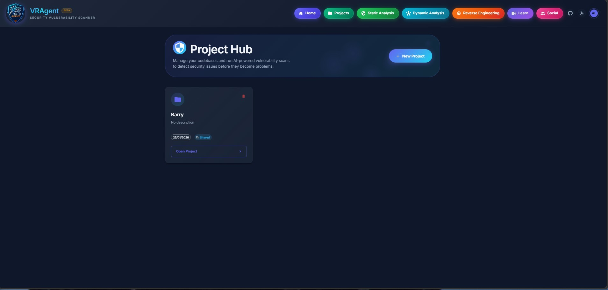
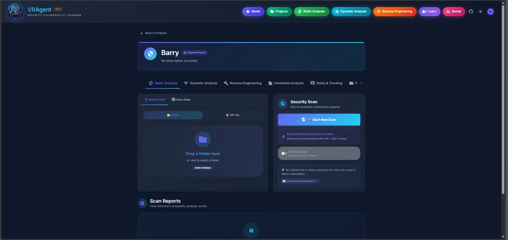

# Projects Hub

## Overview

The Projects hub is the central workspace for managing security assessments in VRAgent. Each project acts as a container for code uploads, scan results, reports, and team collaboration. Projects provide isolated workspaces where you can organize all security testing activities for a specific application or codebase.

## Accessing Projects

- **URL:** `/projects` (list all projects) or `/projects/:id` (project detail)
- **Navigation:** Click "Projects" button in the top navigation bar
- **Authentication:** Required (login to access)

---

## Screenshots

| | |
|:---:|:---:|
|  |  |

---

## Project Management

### Creating a Project

1. Navigate to `/projects`
2. Click **"New Project"** button
3. Enter project details:
   - **Name** (required): Descriptive name for the project
   - **Description** (optional): Brief description of the codebase/application
4. Click **"Create"**

### Project Settings

- **Edit:** Update project name and description
- **Delete:** Permanently remove project and all associated data
- **Share:** Enable team collaboration (see [Collaboration](#collaboration) section)

### Project Dashboard

Each project displays:
- Project name and description
- Creation date and last updated
- Risk score (0-100) from latest scan
- Vulnerability counts by severity
- Recent scan history
- Quick action buttons

---

## Project Tabs

Projects are organized into **10 tabs** for different workflows:

| Tab | Icon | Description |
|-----|------|-------------|
| **Static Analysis** | Security Shield | Code scanning, vulnerability reports, SAST results |
| **Dynamic Analysis** | Network | Network scans, PCAP, SSL, DNS, API testing, fuzzing |
| **Reverse Engineering** | Build | Binary, APK, and Docker image analysis |
| **Combined Analysis** | Summary | Multi-source AI-powered comprehensive reports |
| **Notes & Tracking** | Comment | Project notes and annotations |
| **Files & Docs** | Folder | File browser and document management |
| **Kanban Board** | Kanban | Task management with drag-and-drop |
| **Whiteboard** | Draw | Collaborative diagramming and visualization |
| **Project Chat** | Chat | Team messaging (shared projects only) |
| **Collaborators** | People | Team member management (shared projects only) |

---

## Code Sources

Before running scans, you need to upload or clone code into the project.

### Upload Code

Upload source code as a ZIP archive or folder:

1. Go to the **Static Analysis** tab
2. Select **"Upload Code"** sub-tab
3. Choose upload method:
   - **ZIP Archive:** Upload a `.zip` file containing source code
   - **Folder:** Select a folder from your computer
4. Click **"Upload"**
5. Wait for extraction to complete

### Clone from Git

Clone code directly from a Git repository:

1. Go to the **Static Analysis** tab
2. Select **"Clone Repo"** sub-tab
3. Enter repository details:
   - **Repository URL:** GitHub, GitLab, Bitbucket, or Azure DevOps URL
   - **Branch** (optional): Specific branch to clone (defaults to main/master)
   - **Authentication** (if private): Username and token/password
4. Click **"Clone"**
5. Wait for clone operation to complete

**Supported Git Providers:**
- GitHub (`https://github.com/user/repo`)
- GitLab (`https://gitlab.com/user/repo`)
- Bitbucket (`https://bitbucket.org/user/repo`)
- Azure DevOps (`https://dev.azure.com/org/project/_git/repo`)

---

## Static Analysis Tab

The Static Analysis tab is your primary interface for code security scanning.

### Running a Scan

1. Ensure code is uploaded/cloned (see [Code Sources](#code-sources))
2. Click **"Start New Scan"** button
3. Configure scan options:
   - **Enhanced Mode:** Enable for larger codebases (more files per AI pass)
4. Monitor real-time progress through 12+ phases
5. View results when complete

### Scan Results

After scanning, view:

- **Risk Score:** 0-100 security rating
- **Vulnerability Summary:** Counts by severity (Critical, High, Medium, Low, Advisory)
- **Findings Table:** All detected vulnerabilities with:
  - Severity and type
  - File path and line number
  - Scanner that detected it
  - CVE/CWE references
  - Code snippet
- **Codebase Map:** Interactive file tree with vulnerability counts
- **Exploitability:** AI-generated attack scenarios with PoC outlines

### Scan History

- View all previous scans for the project
- Compare results across scans
- Track vulnerability trends over time
- Delete old scan reports

### Export Options

Export scan results in multiple formats:
- **Markdown:** Clean text format for documentation
- **PDF:** Professional report for stakeholders
- **DOCX:** Editable Word document
- **SBOM:** Software Bill of Materials (CycloneDX or SPDX)

---

## Dynamic Analysis Tab

Access network and runtime security tools linked to the project.

### Available Tools

| Tool | Description |
|------|-------------|
| **Nmap Scanner** | Network discovery and port scanning |
| **PCAP Analyzer** | Packet capture analysis |
| **SSL/TLS Scanner** | Certificate and cipher analysis |
| **DNS Reconnaissance** | Domain enumeration and DNS security |
| **Traceroute** | Network path analysis |
| **API Tester** | Endpoint security testing |
| **Security Fuzzer** | Web application fuzzing |
| **Agentic Fuzzer** | AI-powered autonomous fuzzing |
| **Binary Fuzzer** | Coverage-guided binary fuzzing |
| **MITM Workbench** | Traffic interception and modification |

### Linking Results

Network scan results can be:
- Saved to the project for reference
- Included in Combined Analysis reports
- Correlated with code vulnerabilities

---

## Reverse Engineering Tab

Analyze binaries, APKs, and Docker images associated with the project.

### Analysis Types

| Type | Description |
|------|-------------|
| **Binary Analysis** | PE/ELF executable scanning (11-phase analysis) |
| **APK Analysis** | Android application security (10-phase analysis) |
| **Docker Inspector** | Container image security assessment |

### Features

- Upload binaries, APKs, or select Docker images
- Run comprehensive AI-powered analysis
- View decompiled code (JADX for APK, Ghidra for binaries)
- Detect vulnerabilities, secrets, and attack vectors
- Generate PoC exploits

---

## Combined Analysis

The Combined Analysis feature generates comprehensive security reports by correlating findings from multiple scan types using 9 specialized AI agents.

### Data Sources (10 Types)

Combined Analysis can pull from:

1. **Security Scans (SAST)** - Static code analysis findings
2. **Network Reports (Nmap/PCAP)** - Port scans and packet captures
3. **SSL/TLS Scans** - Certificate and cipher analysis
4. **DNS Reconnaissance** - Domain and subdomain findings
5. **Traceroute Scans** - Network path analysis
6. **Reverse Engineering** - Binary, APK, Docker findings
7. **API Fuzzing Sessions** - Endpoint security tests
8. **Agentic Fuzzer Reports** - AI-driven fuzzing results
9. **Dynamic Scans (DAST)** - Runtime vulnerability testing
10. **Binary Fuzzer** - Coverage-guided fuzzing crashes

### AI Agents (9 Specialized)

| Agent | Purpose |
|-------|---------|
| **Executive Summary** | High-level risk overview for stakeholders |
| **PoC Scripts** | Working Python/Bash exploit code |
| **Attack Guides** | Step-by-step beginner tutorials |
| **Prioritized Vulns** | Risk-ranked findings with exploitation steps |
| **Cross-Analysis** | Correlates all scan types for attack chains |
| **Attack Surface** | Mermaid diagram of entry points |
| **Attack Chains** | Multi-step exploitation paths |
| **Exploit Development** | Advanced exploitation opportunities |
| **Source Code Findings** | Deep code analysis with secure fixes |

### Report Sections

Generated reports include:

- **Executive Summary** - Business-friendly risk overview
- **Risk Overview & Attack Surface** - Entry points and data flows
- **Prioritized Vulnerabilities** - Severity-ranked with CVSS/EPSS
- **Cross-Analysis Findings** - Correlated issues across scan types
- **PoC Scripts** - Ready-to-execute exploit code
- **Attack Guides** - Beginner-friendly tutorials
- **Attack Chains** - Kill chain mapping
- **Source Code Findings** - Code-level analysis with fixes
- **Attack Surface Diagram** - Interactive Mermaid flowchart

### AI Chat

Each Combined Analysis report includes an AI chat assistant:
- Ask questions about the report
- Get explanations of specific vulnerabilities
- Request additional analysis
- Discuss remediation strategies

---

## Notes & Tracking

Keep project notes and annotations organized.

### Features

- Create, edit, and delete notes
- Rich text formatting
- Tagging and categorization
- Search across notes
- Export notes to Markdown

### Use Cases

- Document analysis findings
- Track remediation progress
- Record testing methodology
- Note client requirements

---

## Files & Docs

Manage project files and supporting documents.

### Features

- Browse uploaded code files
- Preview file contents with syntax highlighting
- Upload additional documents (PDFs, Word docs, diagrams)
- Download files
- Document versioning

### Supported Documents

Documents uploaded here can be:
- Referenced during analysis
- Included in Combined Analysis for AI context
- Shared with collaborators

---

## Kanban Board

Project-based task management with drag-and-drop interface.

### Board Features

- **Customizable Columns:** Create, rename, reorder, delete columns
- **Default Columns:** Backlog, To Do, In Progress, Review, Done
- **Drag-and-Drop:** Move cards between columns smoothly
- **Real-Time Sync:** WebSocket-based live updates

### Card Features

| Feature | Description |
|---------|-------------|
| **Title & Description** | Card name and detailed description |
| **Colors** | 16 dark-theme optimized colors for visual categorization |
| **Priority** | Low, Medium, High, Critical levels |
| **Due Date** | Deadline tracking with overdue indicators |
| **Assignee** | Assign to project collaborators |
| **Labels** | Custom tags for categorization |
| **Checklists** | Sub-tasks within cards |

### Card Colors

Choose from 16 colors:
- Red, Orange, Yellow, Lime, Green, Teal
- Cyan, Blue, Indigo, Purple, Pink, Rose
- Gray, Slate, Zinc, Neutral

### Filtering & Search

- Search cards by title/description
- Filter by priority level
- Filter by assignee
- Filter by label
- Filter by due date (overdue, due soon, etc.)
- Show/hide completed cards

### Linking Findings

Cards can be linked to specific vulnerability findings:
- Click on a finding badge to navigate to the vulnerability
- Track remediation status per finding

---

## Whiteboard

Collaborative visual canvas for diagramming and brainstorming.

### Drawing Tools

| Tool | Description |
|------|-------------|
| **Freehand** | Draw with customizable brush size and color |
| **Rectangle** | Draw rectangles and squares |
| **Circle** | Draw circles and ellipses |
| **Line** | Draw straight lines |
| **Arrow** | Draw directional arrows |
| **Text** | Add text annotations |
| **Sticky Notes** | Add colored sticky notes |

### Canvas Controls

- **Infinite Canvas:** Pan in any direction
- **Zoom:** Zoom in/out for detail or overview
- **Grid:** Toggle grid overlay
- **Snap-to-Grid:** Align elements to grid
- **Undo/Redo:** History navigation

### Real-Time Collaboration

- Live cursor tracking for other users
- See who's viewing the whiteboard
- Changes sync instantly across all viewers

### Use Cases

| Use Case | Description |
|----------|-------------|
| **Threat Modeling** | Draw attack trees and STRIDE diagrams |
| **Architecture Review** | Map system components and trust boundaries |
| **Incident Mapping** | Visualize attack paths and timelines |
| **Team Planning** | Sprint planning and task organization |
| **Data Flow Diagrams** | Document how data moves through the system |

### Whiteboard Management

- Create multiple whiteboards per project
- Rename and delete whiteboards
- Export whiteboard as image

---

## Collaboration

### Sharing a Project

Enable team collaboration on a project:

1. Navigate to project settings
2. Enable **"Share Project"** toggle
3. Project Chat and Collaborators tabs become available

### Team Chat

Real-time messaging for shared projects:

- Send messages to all project members
- Share files and screenshots
- @mention specific users
- Message history preserved

### Managing Collaborators

Add and manage team members:

| Action | Description |
|--------|-------------|
| **Add Member** | Invite users by username or email |
| **Remove Member** | Remove access from project |
| **Change Role** | Set as Viewer, Editor, or Admin |

### Collaborator Roles

| Role | Permissions |
|------|-------------|
| **Viewer** | View scans, reports, files (read-only) |
| **Editor** | Run scans, edit notes, manage kanban |
| **Admin** | Full access including member management |

---

## Quick Actions

### From Project List

- **Open Project:** Click project name
- **Quick Scan:** Start scan directly from list
- **Delete Project:** Remove project (with confirmation)

### From Project Detail

- **Start Scan:** Begin new security scan
- **Export Report:** Download latest scan results
- **Share to Social:** Share project/findings to Social Hub conversations
- **Open in New Tab:** Open scan results in new browser tab

---

## Best Practices

### Project Organization

1. **One project per application/codebase** - Keep projects focused
2. **Use descriptive names** - Include version or environment (e.g., "MyApp v2.0 - Production")
3. **Add descriptions** - Document what the project contains

### Scanning Workflow

1. Upload/clone code
2. Run initial scan
3. Review findings in Findings table
4. Check Exploitability for attack scenarios
5. Create Kanban cards for remediation tasks
6. Re-scan after fixes to verify

### Team Collaboration

1. Enable project sharing for team projects
2. Use Kanban to assign tasks
3. Use Project Chat for discussions
4. Use Whiteboard for threat modeling sessions
5. Use Combined Analysis for comprehensive reports

---

## Related Documentation

- [Static Analysis](STATIC_ANALYSIS_README.md) - Detailed SAST scanner documentation
- [Dynamic Analysis](DYNAMIC_ANALYSIS_README.md) - Network and runtime testing tools
- [Reverse Engineering](REVERSE_ENGINEERING_README.md) - Binary and APK analysis
- [Social Hub](SOCIAL_HUB_README.md) - Sharing and collaboration features
