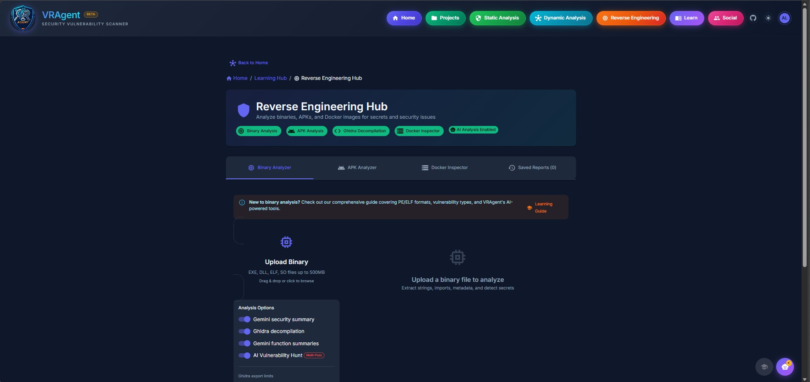

# Reverse Engineering Hub

## Overview

The Reverse Engineering Hub provides comprehensive tools for analyzing binaries (PE/ELF), Android APKs, and Docker images. It combines static analysis, decompilation, AI-powered vulnerability hunting, and dynamic analysis script generation to deliver complete security assessments.

## Accessing Reverse Engineering

- **URL:** `/reverse` (standalone tools) or within a project's Reverse Engineering tab
- **Navigation:** Click "Reverse Engineering" button in the top navigation bar
- **Authentication:** Required (login to access)

---

## Screenshots



---

## Binary Analysis (PE/ELF)

### Unified Binary Scanner (11-Phase Analysis)

The Unified Binary Scanner performs comprehensive analysis through 11 sequential phases:

| Phase | ID | Name | Description |
|-------|-----|------|-------------|
| **1** | `static` | Static Analysis | PE/ELF parsing, metadata, strings, imports, secrets, crypto detection |
| **2** | `ghidra` | Ghidra Decompilation | Full source code decompilation and function export |
| **3** | `ghidra_ai` | Ghidra AI Summaries | AI generates function-level documentation |
| **4** | `ai_summary` | AI Security Summary | Overall security assessment of the binary |
| **5** | `pattern_scan` | Pattern Vulnerability Scan | 80+ vulnerability patterns detection |
| **6** | `cve_lookup` | CVE Database Lookup | OSV.dev + NVD database lookup for libraries |
| **7** | `sensitive_scan` | Sensitive Data Discovery | 40+ patterns for PII, credentials, keys |
| **8** | `ai_verification` | AI Findings Verification | Deduplicate and filter false positives |
| **9** | `vuln_hunt` | AI Vulnerability Hunt | Multi-pass AI-guided deep analysis |
| **10** | `advanced_analysis` | Advanced Analysis | Obfuscation detection, packer analysis |
| **11** | `attack_surface` | Attack Surface Mapping | Entry points, dangerous functions, vectors |

**Additional Optional Phases:**

| Phase | ID | Name | Description |
|-------|-----|------|-------------|
| - | `dynamic_scripts` | FRIDA Script Generation | Generate dynamic analysis scripts |
| - | `emulation` | Symbolic Emulation | Trace execution paths |
| - | `ai_reports` | AI Report Generation | Functionality, security, architecture reports |

### Phase Details (Binary)

#### Phase 1: Static Analysis
- Parse PE/ELF headers and extract metadata
- Extract all ASCII and Unicode strings (4+ characters)
- Identify imports, exports, and library dependencies
- Detect hardcoded secrets (API keys, passwords, tokens)
- Analyze cryptographic usage patterns
- Calculate file and section entropy
- Identify compilation metadata (Rich header for PE, Build ID for ELF)

#### Phase 2: Ghidra Decompilation
- Launch Ghidra headless analyzer
- Perform auto-analysis and function detection
- Decompile all functions to C pseudocode
- Export function signatures and call graphs
- Identify entry points and exported APIs

#### Phase 3-4: AI Analysis
- Generate AI summaries for each decompiled function
- Create overall security assessment
- Identify suspicious code patterns
- Map potential attack vectors

#### Phase 5: Pattern Vulnerability Scan
- Scan imports for 80+ dangerous function patterns
- Check for buffer overflow risks (strcpy, sprintf, gets)
- Detect format string vulnerabilities
- Identify command injection risks
- Find cryptographic weaknesses

#### Phase 6: CVE Lookup
- Extract library names and versions from strings/imports
- Query OSV.dev and NVD for known vulnerabilities
- Enrich with CVSS scores and EPSS probabilities
- Flag CISA KEV (Known Exploited Vulnerabilities)

#### Phase 7: Sensitive Data Discovery
- Scan for 40+ sensitive data patterns
- Detect embedded credentials and API keys
- Find PII (emails, phone numbers, addresses)
- Identify internal URLs and endpoints

#### Phase 8: AI Verification
- Review all findings from previous phases
- Eliminate duplicate findings
- Score confidence levels
- Filter false positives using context analysis

#### Phase 9: AI Vulnerability Hunt
- Multi-pass deep analysis (configurable 2-8 passes)
- Each pass focuses on different vulnerability classes
- Trace data flows from inputs to dangerous sinks
- Identify complex vulnerabilities missed by patterns

#### Phase 10-11: Advanced Analysis & Attack Surface
- Detect packing and obfuscation
- Analyze code complexity and structure
- Map all entry points (exports, callbacks, handlers)
- Identify attack vectors and exploitation paths
- Generate attack surface diagram

### Supported File Types

| Format | Extensions | Description |
|--------|------------|-------------|
| **PE (Windows)** | .exe, .dll | Portable Executable format |
| **ELF (Linux)** | .elf, .so, .out | Executable and Linkable Format |
| **Mach-O (macOS)** | .dylib, .mach | macOS executable format |
| **Raw Binary** | .bin, .o, .a | Generic binary files |

### Static Analysis Features

#### PE Analysis (Windows)

| Feature | Description |
|---------|-------------|
| **Headers** | DOS, NT, Optional headers parsing |
| **Sections** | .text, .data, .rdata, .rsrc analysis |
| **Imports** | Imported DLLs and functions |
| **Exports** | Exported functions |
| **Resources** | Embedded icons, dialogs, version info |
| **Rich Header** | Compiler/linker identification |
| **Imphash** | Import hash for malware identification |
| **Authenticode** | Digital signature verification |
| **Overlay** | Data appended after PE structure |
| **TLS Callbacks** | Thread Local Storage anti-debug |
| **Mitigations** | DEP, ASLR, CFG, SafeSEH detection |
| **Manifest** | UAC requirements, compatibility |
| **Debug Info** | PDB paths, debug directories |
| **Relocations** | Base relocation information |
| **Delay Imports** | Delay-loaded DLLs |

#### ELF Analysis (Linux)

| Feature | Description |
|---------|-------------|
| **Headers** | ELF header, program headers |
| **Sections** | .text, .rodata, .data, .bss, .symtab |
| **Symbols** | Symbol table extraction |
| **Dynamic** | Dynamic linking information |
| **Relocations** | Relocation entries |
| **RELRO** | Relocation Read-Only status |
| **Stack Canary** | Stack smashing protection |
| **NX/DEP** | Non-executable stack |
| **PIE** | Position Independent Executable |
| **Interpreter** | Dynamic linker path |
| **Libraries** | Linked shared libraries |
| **Build ID** | Unique build identifier |
| **GNU Version** | Symbol versioning |

### String Extraction

| Category | Examples |
|----------|----------|
| **URLs** | http://, https://, ftp:// |
| **IPs** | IPv4 and IPv6 addresses |
| **File Paths** | Windows and Unix paths |
| **Registry Keys** | HKEY_LOCAL_MACHINE, etc. |
| **Commands** | cmd.exe, powershell, /bin/sh |
| **Crypto** | AES, RSA, encryption-related |
| **Network** | Socket, HTTP, DNS functions |
| **Debug** | Assertions, debug messages |

### Vulnerability Pattern Detection (80+ Patterns)

| Category | Count | Examples |
|----------|-------|----------|
| **Buffer Overflow** | 15+ | strcpy, sprintf, gets, memcpy |
| **Format String** | 8+ | printf, fprintf, sprintf, syslog |
| **Command Injection** | 10+ | system(), exec(), popen() |
| **Memory Safety** | 12+ | malloc/free issues, use-after-free |
| **Crypto Weaknesses** | 10+ | MD5, SHA1, weak random |
| **Integer Overflow** | 8+ | Arithmetic without bounds checks |
| **Race Conditions** | 5+ | TOCTOU, signal handlers |
| **Information Disclosure** | 10+ | Stack variables, memory leaks |
| **Authentication** | 8+ | Hardcoded credentials, weak auth |

### AI-Powered Analysis

#### Multi-Pass Vulnerability Hunt

| Pass | Focus | Description |
|------|-------|-------------|
| **Pass 1** | Triage | Quick scan of all functions |
| **Pass 2** | Deep Analysis | Focus on suspicious functions |
| **Pass 3** | Cross-Reference | Trace data flows between functions |
| **Pass 4** | Attack Chains | Link vulnerabilities into exploit paths |
| **Pass 5** | Verification | Confirm findings, eliminate false positives |

#### AI Reports Generated

| Report | Description |
|--------|-------------|
| **Functionality Report** | What does this binary do? |
| **Security Assessment** | Overall security posture |
| **Architecture Diagram** | Mermaid diagram of components |
| **Attack Surface Map** | Entry points and vectors |

### Ghidra Integration

| Feature | Description |
|---------|-------------|
| **Decompilation** | Full function decompilation to C |
| **Function List** | All detected functions |
| **Cross-References** | Function call graph |
| **AI Summaries** | AI-generated function documentation |
| **Export** | Download decompiled source |

### FRIDA Script Generation

Automatically generates Frida scripts for:

| Script Type | Purpose |
|-------------|---------|
| **Function Hooking** | Intercept function calls |
| **Argument Logging** | Log function parameters |
| **Return Modification** | Modify function returns |
| **Memory Patching** | Patch bytes in memory |
| **SSL Bypass** | Certificate pinning bypass |

### Crypto Analysis

| Detection | Description |
|-----------|-------------|
| **Algorithm Detection** | AES, DES, RSA, MD5, SHA |
| **Key Material** | Hardcoded keys and IVs |
| **Crypto Constants** | S-boxes, round constants |
| **Weak Crypto** | Deprecated algorithms |
| **Custom Crypto** | Non-standard implementations |

### Entropy Analysis

- Section-by-section entropy calculation
- Packed/encrypted section detection
- High-entropy data identification
- Compression detection

### Exploitability Assessment

| Level | Description |
|-------|-------------|
| **Exploitable** | Direct code execution likely |
| **Probably Exploitable** | Code execution possible with effort |
| **Probably Not Exploitable** | DoS only, no code execution |
| **Not Exploitable** | Benign issue |

---

## APK Analysis (Android)

### Unified APK Scanner (11-Phase Analysis)

| Phase | ID | Name | Description |
|-------|-----|------|-------------|
| **1** | `manifest` | Manifest Analysis | Extract package info, permissions, components from AndroidManifest.xml |
| **2** | `secrets` | Secret Detection | Scan for hardcoded secrets, URLs, API keys |
| **3** | `jadx` | JADX Decompilation | Decompile DEX to Java/Kotlin source code |
| **4** | `code_scan` | Code Security Scan | Pattern-based vulnerability scanning (70+ patterns) |
| **5** | `sensitive_data` | Sensitive Data Discovery | AI-verified scan for passwords, API keys, PII |
| **6** | `cve_lookup` | CVE Database Lookup | Check dependencies against CVE/CWE databases |
| **7** | `vuln_hunt` | AI Vulnerability Hunt | Multi-pass AI-guided vulnerability hunting (optional) |
| **8** | `verification` | AI Finding Verification | Validate findings, confidence scoring, FP elimination |
| **9** | `ai_analysis` | AI Deep Analysis | Cross-reference analysis, code sampling |
| **10** | `advanced_analysis` | Advanced Analysis | Manifest visualization, obfuscation detection |
| **11** | `ai_reports` | AI Report Generation | Functionality, security, architecture, attack surface reports |

**Phase Configuration Options:**

| Option | Default | Description |
|--------|---------|-------------|
| `include_vuln_hunt` | true | Enable multi-pass AI vulnerability hunting |
| `vuln_hunt_max_passes` | 5 | Number of AI analysis passes (2-8) |
| `include_jadx` | true | Enable JADX decompilation |

### Phase Details (APK)

#### Phase 1: Manifest Analysis
- Parse AndroidManifest.xml (binary XML decoding)
- Extract package name, version, SDK versions
- List all declared permissions (dangerous, normal, signature)
- Enumerate components (activities, services, receivers, providers)
- Identify exported components (potential attack surface)
- Extract intent filters and data schemes
- Detect hardware/software feature requirements

#### Phase 2: Secret Detection
- Scan APK resources for hardcoded secrets
- Check strings.xml for API keys and credentials
- Analyze raw resources for embedded tokens
- Identify URLs, endpoints, and server addresses
- Flag debug/development artifacts

#### Phase 3: JADX Decompilation
- Extract DEX files from APK
- Decompile Dalvik bytecode to Java source
- Preserve package structure and class hierarchy
- Extract resource references and R class mappings
- Handle multi-DEX applications

#### Phase 4: Code Security Scan
- Scan decompiled code for 70+ vulnerability patterns
- Check for insecure data storage (SharedPreferences, SQLite)
- Detect WebView vulnerabilities (JavaScript enabled, file access)
- Find SQL injection and path traversal risks
- Identify insecure network communication
- Flag hardcoded cryptographic keys

#### Phase 5: Sensitive Data Discovery
- AI-verified scan of all code and resources
- Detect passwords, API keys, OAuth tokens
- Find PII (emails, phone numbers, SSN patterns)
- Identify internal IP addresses and debug URLs
- Mask sensitive values in output

#### Phase 6: CVE Database Lookup
- Parse library dependencies from build files
- Identify third-party SDKs and frameworks
- Query OSV.dev for known vulnerabilities
- Check native libraries (.so files) for CVEs
- Report CVSS scores and remediation advice

#### Phase 7: AI Vulnerability Hunt (Optional)
- Multi-pass AI analysis of suspicious code
- Focus on authentication and authorization flows
- Trace sensitive data through the application
- Identify business logic vulnerabilities
- Generate exploitation scenarios

#### Phase 8: AI Finding Verification
- Cross-reference findings from all phases
- Assign confidence scores (0-100%)
- Eliminate false positives using context
- Deduplicate similar findings
- Prioritize by severity and exploitability

#### Phase 9: AI Deep Analysis
- Cross-reference analysis across components
- Parallel scan for complex vulnerability chains
- Sample critical code sections for review
- Correlate static findings with component interactions

#### Phase 10: Advanced Analysis
- Generate manifest visualization graph
- Detect obfuscation (ProGuard, DexGuard, R8)
- Identify anti-analysis techniques
- Map component relationships
- Analyze permission usage patterns

#### Phase 11: AI Report Generation
- **Functionality Report:** What does this app do?
- **Security Report:** Comprehensive vulnerability assessment
- **Architecture Diagram:** Mermaid diagram of app structure
- **Attack Surface Map:** All entry points and vectors

### Manifest Analysis

#### Components Extracted

| Component | Security Concerns |
|-----------|-------------------|
| **Activities** | Exported activities, task affinity |
| **Services** | Exported services, binding |
| **Receivers** | Broadcast receivers, intent filters |
| **Providers** | Content providers, permissions |
| **Permissions** | Requested and custom permissions |
| **Features** | Required hardware/software |

#### Permission Analysis

| Category | Examples | Risk |
|----------|----------|------|
| **Dangerous** | CAMERA, LOCATION, CONTACTS | High |
| **Signature** | BIND_DEVICE_ADMIN | Critical |
| **Normal** | INTERNET, VIBRATE | Low |
| **Custom** | App-defined permissions | Varies |

#### Dangerous Permissions (25+)

- `READ_CONTACTS` / `WRITE_CONTACTS`
- `READ_CALL_LOG` / `WRITE_CALL_LOG`
- `CAMERA` / `RECORD_AUDIO`
- `ACCESS_FINE_LOCATION` / `ACCESS_COARSE_LOCATION`
- `READ_SMS` / `SEND_SMS` / `RECEIVE_SMS`
- `READ_EXTERNAL_STORAGE` / `WRITE_EXTERNAL_STORAGE`
- `READ_PHONE_STATE` / `CALL_PHONE`
- `SYSTEM_ALERT_WINDOW`
- `REQUEST_INSTALL_PACKAGES`
- `BIND_ACCESSIBILITY_SERVICE`

### Certificate Analysis

| Check | Description |
|-------|-------------|
| **Signer** | Certificate subject/issuer |
| **Algorithm** | Signature algorithm (SHA256, etc.) |
| **Validity** | Certificate expiration |
| **Debug Cert** | Detection of debug certificates |
| **v1/v2/v3** | APK signature scheme versions |

### DEX Code Analysis

#### Suspicious Patterns Detected

| Category | Indicators |
|----------|------------|
| **Reflection** | getDeclaredMethod, setAccessible, invoke |
| **Crypto** | Cipher, SecretKey, MessageDigest |
| **Native Code** | System.loadLibrary, Runtime.exec |
| **Dynamic Loading** | DexClassLoader, loadClass |
| **Obfuscation** | ProGuard, DexGuard indicators |
| **Anti-Analysis** | isDebuggerConnected, Xposed, Frida |
| **Data Exfiltration** | getDeviceId, getAccounts, getContacts |
| **Root Detection** | su, Superuser, RootBeer |

#### Tracker/SDK Detection (20+)

| Tracker | Package Pattern |
|---------|-----------------|
| **Firebase Analytics** | com.google.firebase |
| **Google Analytics** | com.google.android.gms.analytics |
| **Facebook SDK** | com.facebook. |
| **AppsFlyer** | com.appsflyer |
| **Adjust** | com.adjust.sdk |
| **Branch.io** | io.branch |
| **Amplitude** | com.amplitude |
| **Mixpanel** | com.mixpanel |
| **Segment** | com.segment |
| **Crashlytics** | com.crashlytics |
| **Sentry** | io.sentry |
| **Google Ads** | com.google.ads |
| **Unity Ads** | com.unity3d.ads |

### JADX Integration

| Feature | Description |
|---------|-------------|
| **Decompilation** | DEX to Java/Kotlin source |
| **Resource Extraction** | Layouts, drawables, strings |
| **Manifest** | Decoded AndroidManifest.xml |
| **Code Search** | Search across decompiled code |
| **Export** | Download decompiled project |

### FRIDA Scripts for APK

Automatically generates scripts for:

| Script | Purpose |
|--------|---------|
| **SSL Pinning Bypass** | Multiple pinning implementations |
| **Root Detection Bypass** | RootBeer, custom checks |
| **Emulator Detection Bypass** | Generic and app-specific |
| **Debugger Detection Bypass** | isDebuggerConnected, etc. |
| **Anti-Tampering Bypass** | Integrity checks |
| **Crypto Hooking** | Log encryption/decryption |
| **Network Hooking** | HTTP/HTTPS traffic capture |
| **Method Tracing** | Trace suspicious methods |

### Security Checks (70+ Patterns)

| Category | Checks |
|----------|--------|
| **Hardcoded Secrets** | API keys, passwords, tokens |
| **Insecure Storage** | SharedPreferences, SQLite |
| **Insecure Communication** | HTTP, certificate validation |
| **Code Injection** | WebView JavaScript, SQL |
| **Cryptography** | Weak algorithms, hardcoded keys |
| **Authentication** | Biometric bypass, weak auth |
| **Data Leakage** | Logs, backups, clipboard |
| **Intent Handling** | Intent injection, redirection |

### Obfuscation Detection

| Indicator | Description |
|-----------|-------------|
| **ProGuard** | Standard Android obfuscation |
| **DexGuard** | Commercial obfuscator |
| **R8** | Google's code shrinker |
| **Allatori** | Java obfuscator |
| **StringFog** | String encryption |
| **Name Mangling** | Single-letter class/method names |
| **Control Flow** | Opaque predicates, bogus code |

---

## Docker Inspector

The Docker Inspector provides comprehensive security analysis of Docker images, Dockerfiles, and Docker Compose files with a focus on offensive security vectors.

### Analysis Capabilities

| Feature | Description |
|---------|-------------|
| **Image Inventory** | List all local Docker images with metadata |
| **Layer Deep Scan** | Extract and scan all layers for secrets |
| **Deleted File Recovery** | Find secrets "deleted" but recoverable from layers |
| **Dockerfile Linting** | 30+ security rules including container escape vectors |
| **Docker Compose Scan** | Analyze compose files for misconfigurations |
| **Base Image Intelligence** | EOL, typosquatting, CVE, and trust checks |
| **CVE Scanning** | Integration with Trivy for vulnerability detection |
| **Build Context Scan** | Check for secrets in build context |

### Base Image Intelligence

Comprehensive database of known problematic base images:

#### EOL (End-of-Life) Images

| Image | EOL Date | Severity |
|-------|----------|----------|
| `python:2`, `python:2.7` | 2020-01-01 | Critical |
| `node:8`, `node:10`, `node:12` | 2019-2022 | Critical-High |
| `ubuntu:14.04`, `ubuntu:16.04` | 2019-2021 | Critical-High |
| `debian:jessie`, `debian:stretch` | 2020-2022 | Critical-High |
| `centos:6`, `centos:7`, `centos:8` | 2020-2024 | Critical-High |
| `php:7.2`, `php:7.3`, `php:7.4` | 2020-2022 | Critical-High |
| `ruby:2.5`, `ruby:2.6`, `ruby:2.7` | 2021-2023 | High-Medium |

#### Typosquatting Detection

Detects common typos of popular images that may be malicious:

| Typo | Real Image | Attack Vector |
|------|------------|---------------|
| `ngix`, `ngnix`, `nginix` | nginx | Cryptominer, backdoor |
| `ubunut`, `ubunto` | ubuntu | Malware, rootkit |
| `pytohn`, `pyhton` | python | Supply chain attack |
| `nodjs` | node | Credential theft |
| `alphine`, `apline` | alpine | Container escape |
| `deiban`, `debain` | debian | Persistence |
| `readis`, `redsi` | redis | Data exfiltration |

#### Untrusted Registry Detection

Flags images from unverified registries. Trusted registries:
- `docker.io` (Docker Hub)
- `gcr.io` (Google Container Registry)
- `ghcr.io` (GitHub Container Registry)
- `quay.io` (Red Hat Quay)
- `mcr.microsoft.com` (Microsoft)
- `registry.k8s.io` (Kubernetes)
- `public.ecr.aws` (AWS ECR)

### Dockerfile Security Rules (30+)

#### Privilege & Escape Vectors (Critical)

| Rule | Pattern | Attack Vector |
|------|---------|---------------|
| **DS016** | `--cap-add=SYS_ADMIN` | Mount cgroup + release_agent escape |
| **DS017** | `-v /:/host` | Write to /host/etc/cron.d for root |
| **DS018** | Docker socket mount | `docker run --privileged` from container |
| **DS019** | `--pid=host` | Inject into host processes, read secrets |
| **DS020** | `--net=host` | Sniff traffic, ARP spoof, bind to host |
| **DS021** | `--userns=host` | Container root = host root |

#### Secrets & Credentials (Critical-High)

| Rule | Pattern | Description |
|------|---------|-------------|
| **DS003** | Hardcoded secrets | API keys, passwords in Dockerfile |
| **DS004** | `ARG PASSWORD/SECRET/KEY` | Secrets in build args (visible in history) |
| **DS005** | `ENV PASSWORD=...` | Secrets in environment variables |

#### Privilege Escalation (High)

| Rule | Pattern | Description |
|------|---------|-------------|
| **DS002** | `--privileged` | Full host device access |
| **DS022** | `chmod +s`, `chmod 4755` | SUID bit enables privilege escalation |
| **DS015** | `curl | bash` | MITM can inject malicious code |

#### Configuration Issues (Medium-Low)

| Rule | Pattern | Description |
|------|---------|-------------|
| **DS001** | `USER root` | Container runs as root |
| **DS006** | No apt-get clean | Increased image size |
| **DS007** | No pip --no-cache-dir | Increased image size |
| **DS008** | `ADD https://...` | Unpredictable remote content |
| **DS009** | `FROM image:latest` | Unpinned base image |
| **DS010** | pip without versions | Non-reproducible builds |
| **DS011** | `EXPOSE 22` | SSH in container (anti-pattern) |
| **DS012** | No HEALTHCHECK | No health monitoring |
| **DS013** | ADD for local files | COPY preferred over ADD |
| **DS014** | Shell form CMD | Exec form preferred |

### Layer Deep Scan

Extracts and scans Docker image layers using overlay filesystem semantics to find:

#### Sensitive File Patterns (40+)

| Category | Patterns | Severity |
|----------|----------|----------|
| **SSH Keys** | `id_rsa`, `id_ed25519`, `id_ecdsa` | Critical |
| **Private Keys** | `.pem`, `.key`, `.p12`, `.pfx`, `.jks` | Critical |
| **AWS Credentials** | `.aws/credentials`, `.aws/config` | Critical |
| **GCP Credentials** | `credentials.json`, `service_account.json` | Critical |
| **Azure Credentials** | `.azure/`, `azure.json` | Critical |
| **Kubernetes** | `.kube/config`, `kubeconfig` | Critical |
| **Environment Files** | `.env`, `.env.production` | Critical |
| **Secrets Files** | `secrets.yml`, `secrets.json` | Critical |
| **Git Credentials** | `.netrc`, `.git-credentials` | High |
| **Package Creds** | `.npmrc`, `.pypirc` | High |
| **Docker Config** | `.docker/config.json` | High |
| **Database Creds** | `.pgpass`, `.my.cnf` | High |
| **Shell History** | `.bash_history`, `.zsh_history` | High |
| **DB History** | `.mysql_history`, `.psql_history` | High |
| **App Config** | `wp-config.php`, `settings.py` | Medium |
| **Backups** | `.bak`, `.backup`, `.old` | Medium |

#### Deleted File Recovery

The scanner detects files that were "deleted" in later layers but are still recoverable:

```
Layer 1: ADD credentials.json /app/
Layer 2: RUN rm /app/credentials.json  ← Deleted but recoverable!
```

**Attack Vector:** `docker save image | tar -xf - && cat layer1/app/credentials.json`

The scanner tracks:
- Whiteout files (`.wh.*`) indicating deletions
- Opaque directories (`.wh..wh..opq`)
- Files present in early layers but missing in final image

### Docker Compose Scanning

Analyzes `docker-compose.yml` for:

| Check | Description |
|-------|-------------|
| **Privileged mode** | Services with `privileged: true` |
| **Host mounts** | Dangerous volume mounts |
| **Network mode** | `network_mode: host` |
| **Exposed ports** | Sensitive ports like 22, 3306 |
| **Environment secrets** | Hardcoded credentials in env |
| **Capability additions** | Dangerous capabilities |

### Build Context Scanning

Scans the Docker build context directory for:
- Secrets that would be copied into image
- `.dockerignore` effectiveness
- Large files that shouldn't be in context
- Sensitive directories not excluded

### Trivy Integration

Full integration with Trivy scanner for:

| Feature | Description |
|---------|-------------|
| **OS Packages** | CVEs in apt, apk, yum packages |
| **Language Packages** | npm, pip, gem, cargo vulnerabilities |
| **Base Image CVEs** | Vulnerabilities in parent images |
| **Configuration** | Dockerfile and K8s misconfigurations |
| **Secrets** | Embedded secrets and credentials |
| **SBOM** | Software Bill of Materials generation |

### Risk Scoring

Images receive a risk score (0-100) based on:

| Factor | Weight |
|--------|--------|
| Critical CVEs | 40% |
| Container escape vectors | 25% |
| Exposed secrets | 20% |
| Configuration issues | 10% |
| EOL/untrusted base | 5% |

---

## AI-Powered Tools

### AI Code Explanation

Ask the AI to explain any function or code block:

- Plain English description
- Security implications
- Potential vulnerabilities
- Suggested improvements

### AI Vulnerability Hunting

Multi-pass AI analysis that:

1. Scans all code for security issues
2. Prioritizes suspicious areas
3. Traces data flows
4. Identifies attack chains
5. Generates PoC exploits

### AI Report Generation

| Report Type | Content |
|-------------|---------|
| **Executive Summary** | High-level risk overview |
| **Technical Analysis** | Detailed vulnerability breakdown |
| **Attack Scenarios** | Step-by-step exploitation guides |
| **Remediation Guide** | Specific fix recommendations |

### Symbolic Execution Traces

AI-generated execution traces showing:

- Input to vulnerable function
- Data transformations
- Control flow decisions
- Memory state changes
- Exploitation conditions

---

## Hex Editor

Interactive hex viewer for binary files:

| Feature | Description |
|---------|-------------|
| **Hex View** | Hexadecimal byte display |
| **ASCII View** | Printable character display |
| **Offset Navigation** | Jump to specific offset |
| **Pattern Search** | Search for hex patterns |
| **String Search** | Search for ASCII/Unicode strings |
| **Entropy Graph** | Visual entropy by offset |
| **Structure Highlighting** | PE/ELF header highlighting |

---

## Export Options

### Report Formats

| Format | Description |
|--------|-------------|
| **Markdown** | Clean text report |
| **PDF** | Professional formatted report |
| **JSON** | Machine-readable data |
| **HTML** | Interactive web report |

### Data Exports

| Export | Description |
|--------|-------------|
| **Strings** | All extracted strings (CSV) |
| **Functions** | Decompiled functions (C/Java) |
| **Vulnerabilities** | Findings list (JSON) |
| **FRIDA Scripts** | Generated scripts (JS) |
| **IOCs** | Indicators of Compromise |

---

## Configuration

### Environment Variables

| Variable | Description | Default |
|----------|-------------|---------|
| `GHIDRA_PATH` | Path to Ghidra installation | `/opt/ghidra` |
| `JADX_PATH` | Path to JADX installation | `/opt/jadx` |
| `YARA_RULES_PATH` | Custom YARA rules directory | `/rules` |
| `MAX_BINARY_SIZE` | Maximum file size for analysis | 5GB |

### Required Tools

| Tool | Purpose | Installation |
|------|---------|--------------|
| **Ghidra** | Binary decompilation | Pre-installed in Docker |
| **JADX** | APK decompilation | Pre-installed in Docker |
| **YARA** | Pattern matching | Pre-installed in Docker |
| **Capstone** | Disassembly | Python package |
| **pefile** | PE parsing | Python package |
| **pyelftools** | ELF parsing | Python package |
| **androguard** | APK parsing | Python package |

---

## Best Practices

### Before Analysis

1. **Verify file integrity** - Check hashes before analysis
2. **Use isolated environment** - Analyze in sandboxed container
3. **Document provenance** - Record where binary came from
4. **Check file size** - Ensure within limits

### During Analysis

1. **Start with static** - Static analysis before dynamic
2. **Review AI findings** - AI may have false positives
3. **Cross-reference CVEs** - Verify CVE applicability
4. **Check obfuscation** - Obfuscated code needs more analysis

### After Analysis

1. **Verify exploitability** - Confirm vulnerabilities manually
2. **Document attack paths** - Record exploitation steps
3. **Generate reports** - Export for stakeholders
4. **Save to project** - Link results to project for tracking

---

## Troubleshooting

| Issue | Solution |
|-------|----------|
| **Ghidra timeout** | Increase timeout for large binaries |
| **JADX out of memory** | Increase Java heap size |
| **APK parsing fails** | Check APK is not corrupted |
| **No functions found** | Binary may be stripped; try LIEF fallback |
| **Slow decompilation** | Large binaries take time; be patient |
| **AI features not working** | Check GEMINI_API_KEY is configured |
| **YARA scan fails** | Check YARA rules are valid |

---

## Related Documentation

- [Projects](PROJECT_README.md) - Linking analysis to projects
- [Static Analysis](STATIC_ANALYSIS_README.md) - Source code scanning
- [Dynamic Analysis](DYNAMIC_ANALYSIS_README.md) - Runtime testing
- [Learning Hub](LEARNING_HUB_README.md) - Reverse engineering guides
