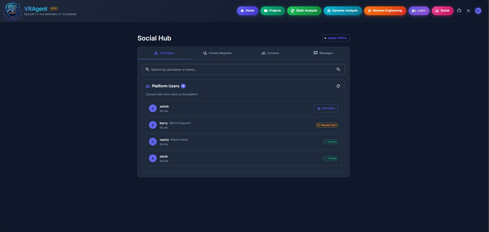
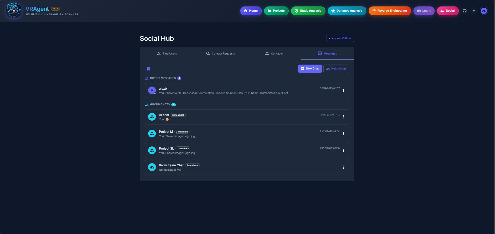

# Social Hub

## Overview

The Social Hub enables collaboration and communication between security professionals using VRAgent. It provides a full-featured social platform with friends, direct messaging, group chats, file sharing, polls, threads, and real-time presence features.

## Accessing the Social Hub

- **URL:** `/social`
- **Navigation:** Click "Social" button in the top navigation bar
- **Authentication:** Required (login to access)

---

## Screenshots

| | |
|:---:|:---:|
|  |  |

---

## Main Tabs

| Tab | Icon | Description |
|-----|------|-------------|
| **Friends** | People | View your friend list with online status |
| **Search** | PersonSearch | Find and connect with other users |
| **Requests** | PersonAdd | Manage incoming and outgoing friend requests |
| **Messages** | Message | Direct messages and group conversations |

---

## Friends System

### Finding Users

| Method | Description |
|--------|-------------|
| **Search** | Search by username, first name, or last name |
| **Suggested** | Browse suggested users (newest first) |
| **Exclude Friends** | Option to hide existing friends from search |

### Friend Requests

| Action | Description |
|--------|-------------|
| **Send Request** | Send friend request to any user |
| **Accept** | Accept incoming request to become friends |
| **Reject** | Decline incoming request |
| **Cancel** | Cancel outgoing request you sent |

### Managing Friends

| Feature | Description |
|---------|-------------|
| **Friends List** | View all accepted friends |
| **Online Status** | See who's online, away, busy, or offline |
| **Start Chat** | Click friend to open direct message |
| **Remove Friend** | Unfriend a user |
| **User Notes** | Add private notes about a friend |

### User Notes

Private notes you can attach to any user:

| Field | Description |
|-------|-------------|
| **Title** | Short note title |
| **Content** | Detailed notes (Markdown supported) |
| **Created/Updated** | Timestamps |

Notes are only visible to you and can be used to remember context about connections.

---

## Messaging

### Conversation Types

| Type | Description |
|------|-------------|
| **Direct Message (DM)** | 1-on-1 private conversation |
| **Group Chat** | Multi-user conversations with roles |

### Sending Messages

| Feature | Description |
|---------|-------------|
| **Text Messages** | Send plain text or Markdown formatted messages |
| **Emoji** | Insert emojis using the emoji picker |
| **File Attachments** | Attach files up to 10MB |
| **Mentions** | @username to mention and notify users |
| **Reply** | Reply to specific messages |
| **Draft Saving** | Unsent messages saved as drafts |

### Message Formatting

Messages support Markdown formatting:

| Format | Syntax | Result |
|--------|--------|--------|
| **Bold** | `**text**` | **text** |
| *Italic* | `*text*` | *text* |
| `Code` | `` `code` `` | `code` |
| Code Block | ` ```lang ` | Syntax highlighted |
| Link | `[text](url)` | Clickable link |
| List | `- item` | Bulleted list |
| Quote | `> text` | Block quote |

### Real-Time Features

| Feature | Description |
|---------|-------------|
| **Typing Indicators** | See when others are typing |
| **Read Receipts** | See who has read your messages |
| **Live Updates** | Messages appear instantly via WebSocket |
| **Connection Status** | Visual indicator of connection state |

### Message Actions

| Action | Description |
|--------|-------------|
| **React** | Add emoji reactions (👍 ❤️ 😂 😮 😢 🔥 👏 🎉) |
| **Reply** | Reply to create threaded conversation |
| **Pin** | Pin important messages to conversation |
| **Forward** | Forward message to other conversations |
| **Edit** | Edit your own messages (with history) |
| **Delete** | Delete your own messages |
| **Bookmark** | Save messages for quick access |
| **Copy** | Copy message content |

### Reactions

| Feature | Description |
|---------|-------------|
| **Quick Reactions** | 8 common emojis for quick response |
| **Full Emoji Picker** | Access complete emoji library |
| **Reaction Count** | See total reactions per emoji |
| **Who Reacted** | View list of users who reacted |

### Pinned Messages

| Feature | Description |
|---------|-------------|
| **Pin Message** | Pin important messages (admins/owners) |
| **View Pinned** | Quick access to all pinned messages |
| **Unpin** | Remove pin when no longer needed |
| **Jump to Message** | Click pinned message to scroll to it |

### Message Search

| Feature | Description |
|---------|-------------|
| **Full-Text Search** | Search message content |
| **Filter by Date** | Search within date range |
| **Filter by User** | Search messages from specific user |
| **Jump to Result** | Click result to scroll to message |

### Bookmarks

| Feature | Description |
|---------|-------------|
| **Bookmark Messages** | Save important messages |
| **Add Notes** | Add notes to bookmarks |
| **Organize** | View all bookmarks in one place |
| **Cross-Conversation** | Bookmarks span all conversations |

### Edit History

| Feature | Description |
|---------|-------------|
| **View History** | See all previous versions of edited messages |
| **Timestamps** | When each edit was made |
| **Diff View** | Compare changes between versions |

---

## File Sharing

### Supported File Types

Files are categorized with appropriate icons:

| Category | Extensions |
|----------|------------|
| **Images** | jpg, jpeg, png, gif, webp, svg, bmp, ico, tiff |
| **Documents** | pdf, doc, docx, odt, rtf |
| **Spreadsheets** | xls, xlsx, ods, csv |
| **Presentations** | ppt, pptx, odp |
| **Code** | py, js, ts, java, c, cpp, go, rs, rb, php, html, css, json, yaml, sql, sh |
| **Archives** | zip, tar, gz, 7z, rar, tgz, bz2, xz |
| **Android** | apk, aab, dex, smali |
| **iOS** | ipa, xib, storyboard, plist |
| **Binaries** | exe, dll, so, dylib, elf, bin, msi, deb, rpm, dmg, jar, wasm |
| **Security** | pcap, pcapng, mem, dmp, yar, yara, rules, evtx |
| **Database** | db, sqlite, sqlite3 |
| **Text** | txt, md, log |

### File Features

| Feature | Description |
|---------|-------------|
| **Upload Progress** | Visual progress bar during upload |
| **File Preview** | Preview images inline |
| **Image Gallery** | View all images in conversation |
| **Download** | Download shared files |
| **File Size** | Displayed in human-readable format |
| **Max Size** | 10MB per file |

---

## Polls

Create polls to gather opinions from conversation members.

### Poll Types

| Type | Description |
|------|-------------|
| **Single Choice** | Select one option |
| **Multiple Choice** | Select multiple options |

### Poll Options

| Option | Description |
|--------|-------------|
| **Anonymous** | Hide who voted for what |
| **Allow Add Options** | Let participants add new options |
| **Expiration** | Auto-close poll after time period |

### Poll Features

| Feature | Description |
|---------|-------------|
| **Create Poll** | Create with question and 2-10 options |
| **Vote** | Cast your vote (change allowed) |
| **Results** | View real-time results |
| **Close Poll** | Creator/admin can close voting |
| **Voter List** | See who voted (if not anonymous) |

### Expiration Options

| Duration | Description |
|----------|-------------|
| **1 hour** | Quick polls |
| **4 hours** | Short-term |
| **1 day** | Daily polls |
| **3 days** | Extended |
| **1 week** | Long-term |
| **Never** | No expiration |

---

## Threads

Reply to specific messages to create threaded discussions.

### Thread Features

| Feature | Description |
|---------|-------------|
| **Start Thread** | Reply to any message |
| **View Thread** | Expand to see all replies |
| **Thread Count** | See number of replies |
| **Reply in Thread** | Continue conversation |
| **Pagination** | Load more replies in batches |

---

## Group Chats

### Creating Groups

| Field | Description |
|-------|-------------|
| **Name** | Group name (required) |
| **Description** | Optional group description |
| **Members** | Select friends to add |

### Group Roles

| Role | Permissions |
|------|-------------|
| **Owner** | Full control, transfer ownership, delete group |
| **Admin** | Manage members, change settings, pin messages |
| **Member** | Send messages, react, view content |

### Group Management

| Action | Who Can Do It |
|--------|---------------|
| **Edit Name/Description** | Owner, Admin |
| **Add Members** | Owner, Admin |
| **Remove Members** | Owner, Admin |
| **Promote to Admin** | Owner |
| **Demote Admin** | Owner |
| **Leave Group** | Anyone |
| **Delete Group** | Owner |

### Group Settings Dialog

| Tab | Content |
|-----|---------|
| **Settings** | Name, description, save changes |
| **Members** | Member list, roles, management actions |
| **Add Members** | Select friends to invite |

---

## Presence & Status

### Status Types

| Status | Color | Description |
|--------|-------|-------------|
| **Online** | Green | Active and available |
| **Away** | Yellow | Temporarily away |
| **Busy** | Red | Busy, limited availability |
| **Do Not Disturb** | Dark Red | Don't send notifications |
| **Offline** | Gray | Not connected |

### Custom Status

| Feature | Description |
|---------|-------------|
| **Status Emoji** | Add emoji to your status |
| **Status Text** | Custom status message |
| **Duration** | Set status for specific time |

### Status Duration Options

| Duration | Description |
|----------|-------------|
| **30 minutes** | Short meeting |
| **1 hour** | Standard break |
| **4 hours** | Extended busy |
| **Today** | Until midnight |
| **Don't clear** | Manual clear required |

### Presence Indicators

- Green pulsing dot for online users
- Status displayed next to username
- Custom status shown in tooltip
- Automatic offline detection

---

## Mute Conversations

| Feature | Description |
|---------|-------------|
| **Mute** | Disable notifications for conversation |
| **Mute Duration** | 1 hour, 8 hours, 24 hours, 1 week, forever |
| **Unmute** | Re-enable notifications |
| **Muted Icon** | Visual indicator when muted |

---

## Sharing Security Findings

Share VRAgent findings and reports directly to conversations.

### Share Findings

| Field | Description |
|-------|-------------|
| **Finding** | Select security finding to share |
| **Conversation** | Choose destination conversation |
| **Message** | Optional message with share |

### Share Reports

| Field | Description |
|-------|-------------|
| **Report** | Select report to share |
| **Conversation** | Choose destination conversation |
| **Message** | Optional message with share |

---

## Offline Support

### Offline Queue

| Feature | Description |
|---------|-------------|
| **Queue Messages** | Messages sent offline are queued |
| **Queue Indicator** | Shows pending message count |
| **Auto Retry** | Messages sent when reconnected |
| **Queue Status** | View queued messages |

### Connection Status

| Status | Indicator |
|--------|-----------|
| **Connected** | Green dot |
| **Connecting** | Yellow spinner |
| **Disconnected** | Red dot |
| **Reconnecting** | Yellow pulsing |

---

## WebSocket Communication

Real-time features powered by WebSocket:

| Event | Description |
|-------|-------------|
| **New Message** | Instant message delivery |
| **Typing** | Real-time typing indicators |
| **Reactions** | Instant reaction updates |
| **Read Receipts** | Live read status |
| **Presence** | Online status changes |
| **Polls** | Vote updates |

### Connection Management

| Feature | Description |
|---------|-------------|
| **Auto Reconnect** | Automatic reconnection on disconnect |
| **Heartbeat** | Keep connection alive |
| **Tab Visibility** | Optimized polling when tab hidden |
| **Error Recovery** | Graceful handling of connection issues |

---

## Authentication

The Social Hub uses JWT authentication with automatic token refresh:

| Token Type | Default Expiry | Purpose |
|------------|----------------|---------|
| **Access Token** | 240 minutes | API requests |
| **Refresh Token** | 7 days | Obtaining new tokens |

### Configuration

```env
ACCESS_TOKEN_EXPIRE_MINUTES=240
REFRESH_TOKEN_EXPIRE_DAYS=7
```

---

## API Endpoints

### User & Friends

| Endpoint | Method | Description |
|----------|--------|-------------|
| `/api/social/users/search` | GET | Search users |
| `/api/social/users/suggested` | GET | Get suggested users |
| `/api/social/users/{id}` | GET | Get user profile |
| `/api/social/friends` | GET | List friends |
| `/api/social/friends/{id}` | DELETE | Remove friend |
| `/api/social/friend-requests` | GET/POST | List/send requests |
| `/api/social/friend-requests/{id}` | PUT/DELETE | Accept/reject/cancel |

### Messaging

| Endpoint | Method | Description |
|----------|--------|-------------|
| `/api/social/conversations` | GET | List conversations |
| `/api/social/conversations/{id}` | GET | Get conversation details |
| `/api/social/conversations/{id}/messages` | GET/POST | List/send messages |
| `/api/social/messages/{id}` | PUT/DELETE | Edit/delete message |
| `/api/social/messages/{id}/reactions` | POST/DELETE | Add/remove reactions |

### Groups

| Endpoint | Method | Description |
|----------|--------|-------------|
| `/api/social/groups` | POST | Create group |
| `/api/social/groups/{id}` | PUT/DELETE | Update/delete group |
| `/api/social/groups/{id}/members` | GET/POST | List/add members |
| `/api/social/groups/{id}/members/{uid}` | PUT/DELETE | Update/remove member |

### Presence

| Endpoint | Method | Description |
|----------|--------|-------------|
| `/api/social/presence/me` | GET/PUT | Get/update my presence |
| `/api/social/presence/bulk` | POST | Get multiple users' presence |

---

## Keyboard Shortcuts

| Shortcut | Action |
|----------|--------|
| `Enter` | Send message |
| `Shift+Enter` | New line in message |
| `Escape` | Close dialogs |
| `@` | Start mention |

---

## Best Practices

### Communication

| Practice | Description |
|----------|-------------|
| **Use Threads** | Keep discussions organized |
| **Pin Important** | Pin key messages for visibility |
| **Use Mentions** | Notify specific people |
| **Set Status** | Let others know your availability |

### File Sharing

| Practice | Description |
|----------|-------------|
| **Security Files** | Share PCAPs, logs, findings |
| **Code Snippets** | Use code blocks for readability |
| **Compress Large** | Zip large file sets |

### Groups

| Practice | Description |
|----------|-------------|
| **Descriptive Names** | Clear group purpose |
| **Use Roles** | Assign admins appropriately |
| **Mute When Needed** | Mute noisy groups |

---

## Troubleshooting

| Issue | Solution |
|-------|----------|
| **Messages not sending** | Check connection status indicator |
| **No notifications** | Check if conversation is muted |
| **Can't see user** | User may have different approval status |
| **Upload fails** | File may exceed 10MB limit |
| **WebSocket disconnecting** | Check network, refresh page |
| **Typing not showing** | WebSocket may be reconnecting |

---

## Related Documentation

- [Projects](PROJECT_README.md) - Share findings from projects
- [Learning Hub](LEARNING_HUB_README.md) - Connect with learners
- [Static Analysis](STATIC_ANALYSIS_README.md) - Findings to share
- [Dynamic Analysis](DYNAMIC_ANALYSIS_README.md) - Reports to share
