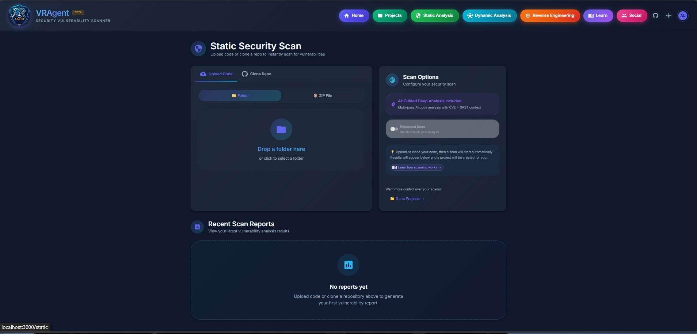

# Static Analysis Hub

## Overview

The Static Analysis Hub provides comprehensive source code security scanning using 14+ specialized SAST (Static Application Security Testing) scanners. It analyzes code for vulnerabilities, misconfigurations, hardcoded secrets, and insecure dependencies across 30+ programming languages.

## Accessing Static Analysis

- **URL:** `/static` (standalone) or within a project's Static Analysis tab
- **Navigation:** Click "Static Analysis" button in the top navigation bar
- **Authentication:** Required (login to access)

---

## Screenshots

---

## Scanning Pipeline

VRAgent executes a **12+ phase scanning pipeline** for comprehensive analysis:

| Phase | Progress | Description |
|-------|----------|-------------|
| **1. Archive Extraction** | 0-5% | Unpack ZIP/clone repository to temp directory |
| **2. File Parsing** | 5-15% | Parallel file discovery and language detection |
| **3. Code Chunking** | 15-25% | Split files into LLM-digestible chunks |
| **4. Embedding Generation** | 25-35% | Generate code embeddings (cached for repeat scans) |
| **5. SAST Scanning** | 35-50% | Run all 14 security scanners in parallel |
| **6. Docker/IaC Scanning** | 50-55% | Container and infrastructure security checks |
| **7. Dependency Analysis** | 55-65% | Parse manifests and lock files |
| **8. CVE Lookup** | 65-72% | Query OSV.dev for known vulnerabilities |
| **9. Transitive Analysis** | 72-76% | Build dependency trees, check indirect deps |
| **10. Vulnerability Enrichment** | 76-82% | NVD data, CVSS scores, EPSS probabilities |
| **11. Agentic AI Scan** | 82-90% | Multi-pass AI-guided deep analysis |
| **12. AI Analysis** | 90-95% | False positive detection, attack chains |
| **13. Report Generation** | 95-100% | Generate findings, summaries, exports |

---

## Security Scanners (14 Tools)

### Language-Specific Scanners

#### Semgrep
**Languages:** 30+ languages (Python, JavaScript, Java, Go, Ruby, PHP, C/C++, etc.)

| Feature | Description |
|---------|-------------|
| **Rules** | 2000+ security rules from Semgrep Registry |
| **Rulesets** | OWASP Top 10, CWE Top 25, language-specific |
| **Analysis** | Semantic code analysis with data flow tracking |
| **Output** | CWE references, OWASP mappings, fix suggestions |

**Detects:**
- Injection vulnerabilities (SQL, command, LDAP)
- Authentication and session issues
- Cryptographic weaknesses
- Insecure configurations
- Framework-specific vulnerabilities

#### Bandit (Python)
**Languages:** Python

| Feature | Description |
|---------|-------------|
| **Confidence** | Medium+ confidence findings only |
| **Categories** | B1xx-B7xx security issue categories |
| **Severity** | Low, Medium, High mappings |

**Detects:**
- SQL injection via string formatting
- Shell injection (subprocess, os.system)
- Hardcoded passwords and secrets
- Weak cryptography (MD5, SHA1, DES)
- Unsafe YAML/pickle deserialization
- Assert statements in production code

#### ESLint Security (JavaScript/TypeScript)
**Languages:** JavaScript, TypeScript, JSX, TSX

| Plugin | Purpose |
|--------|---------|
| `eslint-plugin-security` | General security rules |
| `eslint-plugin-no-unsanitized` | DOM XSS prevention |
| `@microsoft/eslint-plugin-sdl` | Microsoft SDL rules |

**Detects:**
- Cross-site scripting (XSS)
- `eval()` and code injection
- Prototype pollution
- Regular expression DoS (ReDoS)
- Insecure randomness
- Object injection

#### gosec (Go)
**Languages:** Go

**Detects:**
- SQL injection
- Command injection
- File path traversal
- Hardcoded credentials
- Weak cryptography
- TLS/SSL misconfigurations
- Integer overflow risks

#### SpotBugs + FindSecBugs (Java/Kotlin)
**Languages:** Java, Kotlin, Scala

| Component | Purpose |
|-----------|---------|
| **SpotBugs** | General bug detection |
| **FindSecBugs** | Security-focused rules |

**Detects:**
- SQL injection (JDBC, JPA, Hibernate)
- XXE (XML External Entity)
- LDAP injection
- XSS in JSP/Servlets
- Weak cryptography
- Insecure random number generation
- Spring Security issues
- Deserialization vulnerabilities

#### clang-tidy (C/C++)
**Languages:** C, C++

**Detects:**
- Buffer overflows
- Format string vulnerabilities
- Use of insecure functions (gets, strcpy, sprintf)
- Memory safety issues
- Uninitialized variables
- Integer overflow
- Null pointer dereferences

#### Cppcheck (C/C++)
**Languages:** C, C++

**Detects:**
- Memory leaks
- Null pointer dereferences
- Buffer overruns
- Integer overflows
- Use-after-free
- Double-free
- Uninitialized variables
- Dead code

#### PHPCS Security Audit (PHP)
**Languages:** PHP

**Detects:**
- SQL injection
- Cross-site scripting (XSS)
- Command injection
- File inclusion vulnerabilities
- Insecure cryptography
- Session fixation
- CSRF vulnerabilities

#### Brakeman (Ruby/Rails)
**Languages:** Ruby, Ruby on Rails

**Detects:**
- SQL injection
- Cross-site scripting (XSS)
- Mass assignment vulnerabilities
- Remote code execution
- File access issues
- Command injection
- Session management issues
- CSRF vulnerabilities

#### Cargo Audit (Rust)
**Languages:** Rust

**Detects:**
- Known CVEs in dependencies (RustSec Advisory Database)
- Unmaintained crates
- Yanked versions
- Unsafe code patterns

### Cross-Language Scanners

#### Secret Scanner
**Languages:** All files

Scans for 50+ types of hardcoded secrets and credentials:

| Category | Secret Types |
|----------|--------------|
| **Cloud Providers** | AWS Access Keys, Azure Storage Keys, GCP API Keys |
| **Version Control** | GitHub PATs, GitLab Tokens, Bitbucket Keys |
| **Communication** | Slack Tokens, Discord Webhooks, Twilio Keys |
| **Payment** | Stripe Keys (live/test), PayPal Credentials |
| **Email** | SendGrid API Keys, Mailgun Keys, Mailchimp |
| **Database** | MongoDB URIs, PostgreSQL strings, Redis URLs |
| **Authentication** | JWT Secrets, OAuth tokens, API Keys |
| **Private Keys** | RSA, DSA, EC, OpenSSH, PGP private keys |
| **Package Managers** | NPM Tokens, PyPI Tokens, NuGet Keys |
| **AI/ML** | OpenAI Keys, Anthropic Keys, Hugging Face Tokens |

**Severity Levels:**
- **Critical:** AWS keys, private keys, database credentials, live payment keys
- **High:** GitHub tokens, JWT secrets, API keys with broad access
- **Medium:** Test keys, generic API keys, webhook URLs
- **Low:** Publishable keys, public identifiers

#### Docker Scanner
**Languages:** Dockerfiles, docker-compose.yml

**15+ Security Rules:**

| Rule ID | Description | Severity |
|---------|-------------|----------|
| DS001 | Running as root | High |
| DS002 | Hardcoded secrets in ENV/ARG | Critical |
| DS003 | Using ADD instead of COPY | Medium |
| DS004 | Missing HEALTHCHECK | Low |
| DS005 | Using `latest` tag | Medium |
| DS006 | Exposing sensitive ports | High |
| DS007 | Privileged operations | High |
| DS008 | Installing with --no-cache-dir | Low |
| DS009 | Using curl/wget without verification | Medium |
| DS010 | Unnecessary packages installed | Low |
| DS011 | Missing USER instruction | Medium |
| DS012 | Secrets in build args | Critical |
| DS013 | ADD from remote URL | High |
| DS014 | setuid/setgid binaries | High |
| DS015 | World-writable files | Medium |

**Container Image Scanning:**
- Integration with Trivy for CVE detection
- Integration with Grype for vulnerability scanning
- Base image vulnerability assessment

#### IaC Scanner (Infrastructure as Code)
**Languages:** Terraform (HCL), Kubernetes YAML, CloudFormation, ARM Templates

**40+ Built-in Rules:**

| Rule ID | Description | Frameworks |
|---------|-------------|------------|
| IAC001 | Unencrypted storage | Terraform, CloudFormation |
| IAC002 | Public access enabled | All |
| IAC003 | Missing logging/monitoring | All |
| IAC004 | Overly permissive IAM | AWS, Azure, GCP |
| IAC005 | Hardcoded credentials | All |
| IAC006 | Insecure protocols | All |
| IAC007 | Missing encryption in transit | All |
| IAC008 | Unrestricted ingress | Kubernetes, Terraform |
| IAC009 | Missing network policies | Kubernetes |
| IAC010 | Privileged containers | Kubernetes |
| IAC011 | Root filesystem writable | Kubernetes |
| IAC012 | Missing resource limits | Kubernetes |
| IAC013 | Host network/PID enabled | Kubernetes |

**Tool Integration:**
- **Checkov:** Comprehensive IaC scanning
- **tfsec:** Terraform-specific security rules

---

## Dependency Analysis

### Supported Ecosystems (7)

| Ecosystem | Manifest Files | Lock Files |
|-----------|---------------|------------|
| **Python (PyPI)** | requirements.txt, Pipfile, pyproject.toml | Pipfile.lock |
| **JavaScript (npm)** | package.json | package-lock.json, yarn.lock |
| **Java (Maven)** | pom.xml | - |
| **Java (Gradle)** | build.gradle, build.gradle.kts | - |
| **Go** | go.mod | go.sum |
| **Ruby (RubyGems)** | Gemfile | Gemfile.lock |
| **Rust (crates.io)** | Cargo.toml | Cargo.lock |
| **PHP (Packagist)** | composer.json | composer.lock |

### Vulnerability Databases

| Database | Description | Cache Duration |
|----------|-------------|----------------|
| **OSV.dev** | Aggregates CVE, GHSA, and ecosystem advisories | 24 hours |
| **NVD** | NIST National Vulnerability Database | 24 hours |
| **EPSS** | Exploit Prediction Scoring System | 12 hours |
| **CISA KEV** | Known Exploited Vulnerabilities catalog | 24 hours |

### Analysis Features

| Feature | Description |
|---------|-------------|
| **CVE Lookup** | Query OSV.dev for known vulnerabilities |
| **NVD Enrichment** | Full CVSS vectors, CWE mappings, references |
| **EPSS Scoring** | Real-world exploitation probability (0-100%) |
| **KEV Flagging** | Highlight actively exploited vulnerabilities |
| **Transitive Analysis** | Build complete dependency trees |
| **Reachability Analysis** | Check if vulnerable code is actually used |
| **Version Matching** | Match dependencies to specific CVE ranges |

---

## AI-Powered Analysis

### Agentic AI Scanner

The Agentic AI Scanner performs multi-pass deep vulnerability analysis using Google Gemini:

#### Analysis Passes

| Pass | Files | Chars/File | Purpose |
|------|-------|------------|---------|
| **Pass 1: Triage** | 60 (80 enhanced) | 3K (4K enhanced) | Quick security scoring |
| **Pass 2: Focused** | 20 (30 enhanced) | 7K (10K enhanced) | Deeper inspection |
| **Pass 3: Deep** | 8 (12 enhanced) | 18K (30K enhanced) | Full file analysis |

#### Capabilities

- **Data Flow Tracing:** Track user input through the codebase
- **Cross-File Analysis:** Follow function calls across files
- **Context Awareness:** Uses CVE/SAST findings to guide analysis
- **Vulnerability Correlation:** Links findings across scanners
- **Attack Chain Detection:** Identifies multi-step exploitation paths

### AI Analysis Features

| Feature | Description |
|---------|-------------|
| **False Positive Detection** | AI reviews findings to reduce noise |
| **Exploitability Assessment** | Evaluate real-world exploitability |
| **Attack Scenario Generation** | Create step-by-step attack narratives |
| **Remediation Guidance** | Provide specific fix recommendations |
| **Code Explanation** | Explain what code does in plain English |

### Exploit Scenario Generation

AI generates detailed exploit scenarios including:

- **Attack Narrative:** Step-by-step exploitation description
- **Preconditions:** Requirements for successful exploitation
- **Impact Assessment:** Potential damage and scope
- **Proof-of-Concept Outline:** Code snippets for testing
- **Mitigations:** Recommended fixes and hardening

**30+ Built-in Templates** for common vulnerability types:
- SQL Injection, XSS, Command Injection
- SSRF, XXE, Deserialization
- Authentication Bypass, IDOR
- Path Traversal, File Upload
- Cryptographic Weaknesses

---

## Risk Scoring

### Intelligent 0-100 Scale

VRAgent uses a weighted formula with diminishing returns:

| Severity | Max Contribution | Weight |
|----------|------------------|--------|
| **Critical** | 40 points | Highest |
| **High** | 30 points | High |
| **Medium** | 20 points | Medium |
| **Low** | 10 points | Low |

### Minimum Thresholds

- **Any Critical finding:** Guarantees at least 50/100
- **Any High finding:** Guarantees at least 25/100

### Score Interpretation

| Score Range | Risk Level | Color |
|-------------|------------|-------|
| 80-100 | Critical | Red |
| 60-79 | High | Orange |
| 40-59 | Medium | Yellow |
| 0-39 | Low | Green |

---

## Scan Results

### Findings Table

Each finding includes:

| Field | Description |
|-------|-------------|
| **Severity** | Critical, High, Medium, Low, Advisory |
| **Type** | Vulnerability category (SQLi, XSS, etc.) |
| **File** | File path relative to project root |
| **Line** | Line number(s) where issue occurs |
| **Scanner** | Tool that detected the finding |
| **Message** | Description of the vulnerability |
| **CWE** | Common Weakness Enumeration ID |
| **CVE** | CVE identifier (if applicable) |
| **CVSS** | CVSS score (if available) |
| **EPSS** | Exploitation probability percentage |
| **Code Snippet** | Vulnerable code with context |

### Codebase Map

Interactive file tree visualization:

- **File Tree:** Hierarchical view of all scanned files
- **Vulnerability Counts:** Per-file finding counts by severity
- **Heatmap Overlay:** Visual density of findings
- **Breadcrumb Navigation:** Quick folder traversal
- **Code Preview:** Syntax-highlighted file contents
- **Jump to Finding:** Click severity badges to scroll to issues

### Exploitability View

AI-generated attack scenarios displayed as cards:

- **Attack Narrative:** Step-by-step exploitation
- **Impact:** Potential damage assessment
- **PoC Outline:** Proof-of-concept guidance
- **Mitigations:** Recommended fixes

---

## Scan Modes

### Quick Scan (Default)

- Standard file limits per AI pass
- Suitable for most codebases
- Faster completion time

### Enhanced Scan

- Increased file limits (80 vs 60 files in Pass 1)
- More characters per file analyzed
- Better for large codebases (10,000+ files)
- More thorough AI analysis

---

## Caching & Performance

### Redis Caching

| Cache Type | Duration | Purpose |
|------------|----------|---------|
| **OSV CVE Lookups** | 24 hours | Reduce API calls |
| **NVD Enrichment** | 24 hours | Cache vulnerability details |
| **EPSS Scores** | 12 hours | Cache exploitation probabilities |
| **Code Embeddings** | Permanent | Reuse for unchanged files |

### Embedding Reuse

Repeat scans skip embedding generation for unchanged code:

- Files are fingerprinted by path, line range, and content hash
- Only new or modified code gets sent for embedding
- Dramatically reduces AI API costs on incremental scans

### Parallel Execution

- SAST scanners run in parallel (up to CPU cores × 2)
- Docker, IaC, and dependency analysis run concurrently
- Automatic result aggregation from all parallel phases

### Deduplication

Cross-scanner finding deduplication:

- Merges duplicate findings from different scanners
- Location-based and content-based matching
- Preserves highest severity and combines metadata

---

## Export Options

### Report Formats

| Format | Description | Use Case |
|--------|-------------|----------|
| **Markdown** | Clean text with tables and links | Documentation, wikis |
| **PDF** | Formatted with title page and styling | Client deliverables |
| **DOCX** | Editable Word document | Further editing |

### Report Contents

All exports include:

- Executive summary
- AI-generated application overview
- AI security analysis
- Severity breakdown with statistics
- Detailed findings table
- CVE/CWE references with links
- CVSS scores and EPSS probabilities
- Exploit scenarios with PoC outlines
- Remediation recommendations

### SBOM Generation

Software Bill of Materials exports:

| Format | Version | Standard |
|--------|---------|----------|
| **CycloneDX** | 1.5 | OWASP standard |
| **SPDX** | 2.3 | Linux Foundation standard |

---

## Configuration

### Environment Variables

| Variable | Description | Default |
|----------|-------------|---------|
| `GEMINI_API_KEY` | Google Gemini API key for AI features | - |
| `NVD_API_KEY` | NIST NVD API key for enrichment | - |
| `MAX_PARALLEL_SCANNERS` | Maximum concurrent scanner processes | CPU × 2 |
| `MAX_TOTAL_CHUNKS` | Maximum code chunks to process | 5000 |
| `CHUNK_FLUSH_THRESHOLD` | Chunks before flushing to DB | 500 |

### File Filtering

**Skipped Extensions:**
- Images: .png, .jpg, .gif, .svg, .ico
- Media: .mp3, .mp4, .wav, .avi
- Documents: .pdf, .doc, .docx, .xls
- Archives: .zip, .tar, .gz, .rar
- Binaries: .exe, .dll, .so, .bin
- Minified: .min.js, .min.css

**Skipped Directories:**
- node_modules, __pycache__, .git
- venv, .venv, virtualenv
- dist, build, target, out
- .idea, .vscode
- coverage, .nyc_output

**Maximum File Size:** 1 MB

---

## Best Practices

### Before Scanning

1. **Remove sensitive data** from code before uploading
2. **Use .gitignore** patterns to exclude unnecessary files
3. **Ensure code compiles** (some scanners need valid syntax)

### Interpreting Results

1. **Start with Critical/High** findings
2. **Check EPSS scores** for real-world risk
3. **Review AI exploitability** assessments
4. **Verify findings** before remediation
5. **Use Codebase Map** to find hotspots

### Reducing False Positives

1. **Review Advisory** severity items (hardening suggestions)
2. **Check context** - test files may flag differently
3. **Use AI verification** to filter noise
4. **Mark false positives** for future reference

### Incremental Scanning

1. **Re-scan after fixes** to verify remediation
2. **Compare scan results** to track progress
3. **Leverage caching** for faster repeat scans

---

## Troubleshooting

| Issue | Solution |
|-------|----------|
| **Scan stuck at 0%** | Check worker logs: `docker compose logs worker` |
| **No findings detected** | Verify code uploaded correctly, check file types |
| **AI features not working** | Ensure `GEMINI_API_KEY` is set |
| **Slow scans** | Enable Enhanced mode for large codebases |
| **Memory errors** | Reduce `MAX_TOTAL_CHUNKS` setting |
| **Scanner not detecting language** | Check file extensions match expected patterns |

---

## Related Documentation

- [Projects](PROJECT_README.md) - Project management and scan history
- [Dynamic Analysis](DYNAMIC_ANALYSIS_README.md) - Runtime security testing
- [Learning Hub](LEARNING_HUB_README.md) - Security scanning guides
